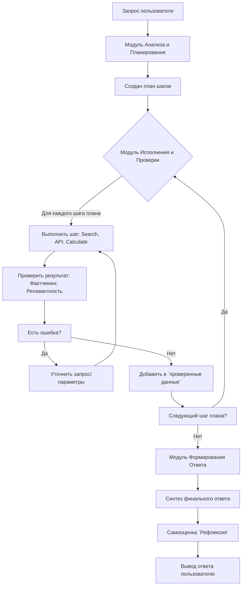

🔥 1 задание. Подключение LLM

- Подключить любую ллм в свой проект
- Сделать общение в виде чата внутри своей ллм

Результат: Вы пишете сообщение - она отвечает
Формат: Код + Видео

Всем удачи

🔥 День 2. Настройка AI

Привет, ангелы. Сегодня задание такое

- Научиться задавать формат результата для возвращения
- Задайте агенту формат возвращения в prompt
- Приведите пример формата возврата

Результат: Ответ от LLM можно распарсить
Формат: Код + Видео

🔥 День 3. Общение

- Задать ограничение модели, чтобы она сама остановилась
- Опишите в промпте результат, который модель должна собрать и выдать вам ответ
- Как пример можно использовать данные для ТЗ

Результат: Вы общаетесь и модель выдает вам какой-то результат на основе вашего общения (например, ТЗ)
Формат: Видео

🔥 День 4. Взаимодействие

Доброе утро, ангелы

- Создайте в коде два класса со своими моделями
- Настройте их взаимодействие
- Агент 1 делает задачу 1, выгружает результат в читаемом формате для агента 2 и тот на базе этого делает другую работу

Результат: Есть взаимодействие агентов, где второй проверяет работу первого
Формат: Код + Видео

🔥 День 5. MCP Start

Привет, ангелы

- Подключить существующие MCP к любому своему проекту
- Нужно это делать не в коде, а просто в интерфейсе ИИ поиспользовать MCP и разобраться как это работает

Результат: Вы обновили что-то в своих сервисах (читай сделали себе что-то полезное)
Формат:  Видео

🔥 День 6. MCP Connect

Доброе утро, ангелы

Сегодня ваша задача в том, чтобы сконнектить свое приложение через MCP с каким-то своим сервисом (это может быть гитхаб, джира, что угодно)

Результат: Вы получили или отправили какие-то данные (хоть hello world)
Формат:  Видео + Код

🔥 День 7. MCP Update

Делаем суммаризатор

- Используя MCP на прошлом этапе ваша задача собрать данные из любой своей системы и сделать некий отчет (любой, например, количество незавершенных тасок и анализ этих тасок)

Результат: Вы получили отчет
Формат:  Видео + Код

🔥 День 8. MCP Realtime

Ваша задача
- Запустить докер или свой VPS и крутить на нем ваше приложение 24/7, чтобы оно раз в какое-то время присылало отчет полученный из MCP

Результат - вы получите напоминание или отчет вечером сегодня и каждый день в течение этого челленджа
Формат:  Видео

🔥 День 9. MCP x 2

Ваша задача
- Добавить второй MCP
- Наладить взаимодействие между ними в своем приложении (один чето делает, второй делает на его базе)

Результат на видео
Формат: Видео + Код

🔥 День 10. Environment

Задача: Соединить агента с реальным окружением, заставить поднимать докер (как вариант эмулятор) и запускать в нем что-то

Результат: Вы можете как итог своей работы что-то проверить на реальном девайсе
Формат: Видео + Код

🔥 День 11. Testing

- Написать простой код (пару функций или классов)
- Написать автотесты с помощью ИИ к нему

Результат: Убедиться, что автотесты корректно работают и проверяют код
Формат: Видео + Код

🔥 День 12. Run

- Написать агента в вашем коде, который берет ваш код и пишет тесты к нему с помощью ИИ

Результат: Убедиться, что автотесты корректно работают и проверяют код
Формат: Видео + Код

🔥 День 13. Run + Testing

- Берем агента из прошлой задачи и он не только должен написать тесты, но и запустить их в реальном окружении и проверить свое тестирование

Результат: Убедиться, что автотесты корректно работают и проверяют код
Формат: Видео + Код

🔥 День 14. Диверсификация

- Возьмите любой из своих сниппетов и подключите другую модель
- Поработайте с агентом и сделайте выводы про разницу

Результат: Найти отличия в работе
Формат: Видео

🔥 День 15. Реальная задача

- Придумайте любую задачу реальную (как вариант вам - выложить в стор приложение, завести хостинг)
- Сделайте приложение, которое будет делать эту задачу

Результат: Есть пайплайн (он может не работать из-за ключей)
Формат: Видео + Код
При заполнении укажите какую задачу вы сделали

🔥 День 16. Параметры

Протестировать ИИ с разными параметрами температуры и количества токенов

Результат: Сделаны наблюдения, выводы записаны
Формат: Видео

🔥 День 17. Compression + Start

Взять свои исходники, попытаться их закинуть в ИИ так, чтобы оно решило проблему

Результат: Исходники закинуты, проблема решена (например, пофикшен баг)
Формат: Видео + Код

**Задачи для выполнения:
- необходимо реализовать агента, который будет получать на вход файл или папку
- Агент должен проанализировать код на правильность и работоспособность.
- Агент должен исправить в переданном файле обнаруженные проблемы, показать в виде диффа в сообщении что он исправил (красное-убрал зеленое-добавил)
- Все изменения агент должен сохранить в переданном файле после одобрения пользователя

Для данного агента можно использовать разработки из экрана code_ops. Но необходимо создать новую вкладку с новым экраном и новым агентом
Первый этапом разработай план, запиши его в отдельный файл проекта.**

- По запросу от пользователя необходимо запустить этот код в докере с получением логов запуска


🔥 День 19. Pairing

Скооперироваться с кем-то в чате (если количество нечетное, можно одну команду сделать на троих) и соединиться два ваших сервиса (один человек делает свой сервис, другой другой и потом вы их соединяете)

Формат:  Код

Насчет отчетности
Можно заполнить одну ячейку, а остальным указать на того с кем работали
Тот кто заполняет ячейку тоже должен указать с кем работал

Задание для создания агента
Цель: 
- создание приложения-агента llm с подключаемым сервером mcp.
- Функцианальность приложения: по запросу пользователя llm используя подключенный MCP сумаризирует ответ и выдает пользователю человеко читаемую информацию
- Приложение создавай в основной директории разработки AI-intensive отдельным от всех других частей проекта приложением
- Описание интерфейса пользователя: 
- Окно с верхим аппбаром, основным полем где отображаются сообщения от пользователя и llm, Внизу поле ввода текста запроса и кнопка Отправить.
- Аппбар содержит название приложения, подключенную нейросеть, справа кнопки Очистка контекста, Настройки
- Основное поле должно отображать сообщения от пользователя (на голубом фоне) и сообщения от llm. Сообщения от нейросети текстового формата отображаются на светлозеленом фоне. Сообщения со сводной информацией парсятся к читаемому виду и отображаются в блоке, позовляющем копировать текст.
Описание интерфейса MCP
## 🔧 MCP Tools

### `tg.resolve_chat`

Resolves chat identifiers to internal format.

**Input:**
```json
{
  "input": "@telegram"
}
```

**Output:**
```json
{
  "chat_id": "136817688",
  "kind": "channel",
  "title": "Telegram News"
}
```

### `tg.fetch_history`

Fetches message history with pagination and filtering.

**Input:**
```json
{
  "chat": "@telegram",
  "from": "2025-01-01T00:00:00Z",
  "to": "2025-01-02T00:00:00Z",
  "page_size": 100,
  "cursor": "base64_encoded_cursor",
  "search": "bitcoin",
  "filter": "links"
}
```

**Output:**
```json
{
  "messages": [
    {
      "id": 12345,
      "date": "2025-01-01T10:30:00Z",
      "from": {
        "peer_id": "channel:136817688",
        "kind": "channel",
        "display": "Telegram"
      },
      "text": "Breaking news...",
      "views": 10000,
      "forwards": 500
    }
  ],
  "page_info": {
    "cursor": "next_cursor_base64",
    "has_more": true,
    "count": 100,
    "fetched": 100
  },
  "export": {
    "uri": "mcp://resources/export/telegram.ndjson",
    "format": "ndjson"
  }
}
```

## 📚 API Reference

### Response Format

All tools return MCP-compliant responses with:

1. **content[]**: Human-readable summary (for compatibility)
2. **structuredContent**: Machine-readable data with JSON Schema validation
3. **Resources**: NDJSON exports for large datasets (when applicable)

### Error Handling

Standardized error codes:
- `FLOOD_WAIT`: Rate limit exceeded, includes retry_after
- `CHANNEL_PRIVATE`: Access denied to private channel
- `USERNAME_INVALID`: Invalid chat identifier
- `INPUT_VALIDATION`: Invalid request parameters

### Pagination

- **Cursor-based**: Opaque base64-encoded cursors
- **Date filtering**: Server-side UTC filtering
- **Deduplication**: Automatic message deduplication
- **Resource limits**: Max 100 messages per page

Перед началом разработки создай полный план работ, запиши его в роадмапу приложения.


🔥 День 21. Hugging Face

Протестировать несколько моделей из рейтинга HuggingFace (с верхней части, средней и из нижней части) и сравнить результаты

Результат: Проведен анализ, сделаны выводы
Формат:  Видео


🔥 День 22. CI/CD

Добавьте агента в часть pipeline (сбор документации, формирования key features, можно взять что-то свое)

Результат: Рабочий пайплайн
Формат:  Видео + Код

---
## Постановка задачи

Необходимо создать Агента, который будет работать на сервере. Агент будет подключаться к серверу MCP телеграма.
Функции Агента:
- Получение сообщений от пользователя
- Обработка сообщений из указанных каналов и чатов
- Отправка сообщений в указанные каналы и чаты
- Анализ сообщений и сумаризация ответа
- Отправка ответа в указанные каналы и чаты
- Отправка уведомления в указанные каналы и чаты

MCP сервер для агента - https://github.com/chaindead/telegram-mcp

🔥 День 23. Memory

Сделайте так, чтобы агента можно было остановить на каком-то месте и продолжить с сохраненной памятью (например, в Redis, SQLite, или LangChain memory)

Результат: Рабочий код
Формат:  Видео + Код


🔥 День 24. Voice

Добавьте своему агенту голосовой ввод-вывод

Результат: Рабочий код
Формат:  Видео + Код

На основе текста сделай четкий промпт для нейросети

Задача
Необходимо подключить в агента @reasoning_agent.dart при выборе llm yandex возможность распознования-синтеза речи.
Докумнетация по API для speech kit https://yandex.cloud/ru/docs/speechkit/quickstart/stt-quickstart-v1
синтез https://yandex.cloud/ru/docs/speechkit/quickstart/tts-quickstart-v1

Агент должен при включении функции распознования речи получать на вход wav файл и отправлять его в llm. После распознования отдавать текст.
Для синтеза речи агент должен получать на вход текст и отдавать результат работы llm

Интегрируй новые функции агента в экран рассуждающей модели агента. Добавь на этом экране кнопку записи аудио слева от поля ввода текста. На карточках ответа агента добавь кнопку воспроизведения синтезированной речи (отправка в llm содержимого карточки и озвучивание результата)
Новые элементы включай только при выборе Яндекс GPT.
Перед разработкой составь план работ в виде чеклиста. Отмечай в нем выполненные пункты.
@readme-roadmap.md @tests.md

Отличное техническое задание. Вот четкий и структурированный промпт, созданный на его основе, который можно передать нейросети (например, GPT-4o, Claude 3 или другому LLM-ассистенту для генерации кода).

---

### Промпт для нейросети-разработчика (например, GPT-4o, Claude 3)

**Роль:** Ты senior Dart/Flutter разработчик, эксперт по интеграции сторонних API, особенно Yandex Cloud SpeechKit.
**Контекст:** Я работаю над агентом ИИ (`reasoning_agent.dart`), который использует различные LLM. Мне необходимо добавить поддержку распознавания и синтеза речи через Yandex SpeechKit, но только когда выбран провайдер `llm yandex`.
 **Задача:** Напиши код для интеграции функций STT (Speech-to-Text) и TTS (Text-to-Speech) в существующего агента и обнови пользовательский интерфейс согласно требованиям ниже.

 **Технические требования и план работ (Чеклист):**

 **1. Анализ и настройка зависимостей:**
   - [x] Добавить необходимые пакеты в `pubspec.yaml`: `http` для API-запросов, `path_provider` для работы с файлами, `audioplayers` для воспроизведения аудио, `permission_handler` для запроса разрешений.
   - [x] Убедиться, что есть класс или модуль для работы с Yandex Cloud API (уже должен быть для LLM, возможно, потребуется общий клиент с аутентификацией через IAM-токен или API-ключ).

 **2. Реализация функции распознавания речи (STT):**
   - [x] Создать метод `Future<String> _recognizeSpeech(String audioFilePath)`.
   - [x] Метод должен принимать путь к WAV-файлу.
   - [x] Сформировать правильный POST-запрос к эндпоинту STT: `https://stt.api.cloud.yandex.net/speech/v1/stt:recognize`.
   - [x] В заголовках (`headers`) указать Authorization: `Api-Key <YOUR_API_KEY>`.
   - [x] Тело запроса (`body`) — закодированный binary-файл WAV.
   - [x] Обработать ответ и извлечь распознанный текст из JSON-поля `result`.
   - [x] Возвращать этот текст агенту для последующей отправки в LLM.

 **3. Реализация функции синтеза речи (TTS):**
   - [x] Создать метод `Future<String> _synthesizeSpeech(String text)`.
   - [x] Метод должен принимать текст для озвучивания.
   - [x] Сформировать POST-запрос к эндпоинту TTS: `https://tts.api.cloud.yandex.net/speech/v1/tts:synthesize`.
   - [x] В заголовках указать аналогичный API-ключ.
   - [x] Передать в параметрах запроса (`queryParameters` или `body`) текст, голос (напр., `alena`), формат выходного аудио (напр., `lpcm` или `oggopus`).
   - [x] Получить из ответа бинарные данные аудиофайла.
   - [x] Сохранить их в临时ный файл в локальном хранилище устройства и вернуть путь к этому файлу.
   - [x] Воспроизвести полученный файл с помощью `audioplayers`.

 **4. Интеграция с агентом и логикой приложения:**
   - [ ] Модифицировать метод агента, который обрабатывает ввод, чтобы он мог принимать не только текст, но и путь к аудиофайлу. Если получен аудиофайл, вызвать `_recognizeSpeech()` и передать результат в LLM.
   - [ ] Для синтеза: добавить вызов `_synthesizeSpeech()` после получения текстового ответа от LLM, если функция активна.
   - [x] Все новые функции и UI-элементы должны быть обернуты в условие `if (selectedLlmProvider == "yandex")`.

 **5. Обновление пользовательского интерфейса (UI):**
   - [x] **Экран рассуждающей модели:** Добавить кнопку записи аудио (иконка микрофона) слева от текстового поля ввода.
   - [x] Реализовать логику записи аудио (можно использовать пакет `sound_recorder` или аналогичный), сохранять запись в WAV-формате и передавать путь к файлу агенту.
   - [x] **Карточки ответа агента:** Добавить кнопку "воспроизвести" (иконка динамика) на каждую карточку с ответом.
   - [x] По нажатию на кнопку отправить текст из карточки в метод `_synthesizeSpeech()` и воспроизвести результат.

 **6. Тестирование и обработка ошибок:**
   - [ ] Написать проверки на наличие сетевого соединения.
   - [x] Реализовать обработку ошибок API Yandex (неверный ключ, квоты, формат файла).
   - [x] Убедиться, что разрешения на запись аудио и доступ к хранилищу запрашиваются и обрабатываются корректно.

**Критические замечания:**
- Не изменяй существующую логику работы с другими LLM-провайдерами.
- Код должен быть чистым, хорошо документированным и соответствовать Dart style guide.
- Предусмотри индикаторы загрузки во время процессов записи, отправки и получения аудио.
**Формат ответа:** Предоставь готовый к внедрению код на Dart/Flutter. Сначала покажи основные методы (STT, TTS), затем изменения в агенте, потом — relevant куски кода из UI (виджеты с кнопками). Используй комментарии `// ...` для пропуска нерелевантных частей кода.


🔥 День 25. Chain of Thought

Научите агента «думать» перед ответом — реализуйте цепочку размышлений (reasoning). Это может быть простая цепочка: мысль → проверка → ответ.

Результат: Агент, обоснованно приходящий к решению
Формат: Видео + Код

Отличная задача! Реализация цепочки рассуждений (Reasoning Chain) — это ключ к созданию по-настоящему "умных" и надежных агентов. Концепция "Мысль-Проверка-Ответ" (Think-Check-Respond) — это частный случай более общего подхода **ReAct (Reasoning + Acting)**.

Предлагаю вам расширенную и практичную концепцию для вашего агента.

### Ключевая идея: Модульный Конвейер Рассуждений

Агент должен обрабатывать запрос не как единый монолитный prompt, а как конвейер из последовательных, независимых модулей. Это повышает надежность, контролируемость и позволяет легко модифицировать логику.

---

### Концепция: Многоэтапный Агент Рассуждений (Multi-Stage Reasoning Agent)

Эта цепочка состоит из нескольких ключевых модулей, которые передают друг другу управление и данные.

#### 1. Модуль Анализа и Планирования (Think/Reason)
**Цель:** Понять глубинный intent (намерение) пользователя и разбить сложную задачу на подзадачи.

**Что происходит:**
*   **Декомпозиция:** Агент разбивает сложный запрос на более простые, последовательные шаги.
 *   *Запрос:* "Напиши план сочинения на тему 'Образ Чацкого' и подбери цитаты для первого аргумента."
 *   *Мысль/План:*
  1.  Создать структуру плана сочинения (введение, аргумент 1, аргумент 2, аргумент 3, заключение).
  2.  Для аргумента 1 определить ключевую черту характера (например, "остроумие и насмешливость").
  3.  Найти в памяти (или с помощью поиска) 2-3 подходящие цитаты, иллюстрирующие эту черту.
  4.  Объединить результаты в ответ.
*   **Определение контекста:** Агент решает, какой контекст (история разговора, знания из базы данных) ему нужен.
*   **Выбор стратегии:** Решает, нужен ли поиск в интернете, вычисления, анализ данных и т.д.

**Техническая реализация:** Отдельный LLM-вызов с системным промтом, который заставляет модель рассуждать шаг за шагом. Пример промта:
```
Ты - AI-ассистент, который тщательно планирует свои ответы. Текущий запрос пользователя: "{user_input}".

Разбери этот запрос. Создай пошаговый план ответа. Не давай ответ сразу, а просто outline (набросок) шагов.
Важные вопросы для себя: Нужны ли факты? Нужно ли искать данные? Нужно ли разбивать задачу на части?
```

---

#### 2. Модуль Исполнения и Проверки (Act/Check)
**Цель:** Выполнить намеченный план, проверив каждый шаг на достоверность и релевантность.

**Что происходит:**
*   **Извлечение знаний:** Агент выполняет намеченные действия: ищет информацию в векторной БД, вызывает внешние API (калькулятор, поисковик), анализирует документы.
*   **Критическая проверка (Важный этап!):**
 *   **Фактчекинг:** Сверяет полученные факты с доверенными источниками *или* проверяет их на внутреннюю непротиворечивость. Например, "Если это дата рождения писателя, я уверен в ней? Или мне нужно перепроверить в другом источнике?"
 *   **Оценка релевантности:** "Та цитата, которую я нашел, действительно подходит для аргумента про 'остроумие'?"
 *   **Обнаружение противоречий:** "Информация из первого источника противоречит информации из второго. Нужно разобраться."
 *   **Оценка уверенности:** Агент может присваивать каждому факту "уровень уверенности".

**Техническая реализация:** Это часто цикл, где LLM взаимодействует с инструментами (tools/function calling).
*   Агент решает: "Мне нужно найти цитаты Чацкого про остроумие".
*   Он вызывает функцию `vector_db_search(query="Чацкий цитаты остроумие насмешка")`.
*   Получает результаты.
*   **Следующий LLM-вызов (проверка):** "Вот план: ... Вот результаты поиска: ... Проверь, релевантны ли эти цитаты задаче. Если нет, сформулируй более точный поисковый запрос."

---

#### 3. Модуль Формирования Ответа и Рефлексии (Respond/Reflect)
**Цель:** Собрать проверенные данные в качественный, структурированный ответ и оценить его качество.

**Что происходит:**
*   **Синтез:** Объединение всех проверенных данных и шагов в единый, связный текст.
*   **Форматирование:** Приведение ответа в нужный вид (markdown, список, JSON).
*   **Рефлексия (Самооценка):** *Крайне важный этап для улучшения!*
 *   Агент задает себе вопросы: "Я полно ответил на исходный запрос?", "Где слабые места в моих рассуждениях?", "Можно ли было сделать что-то более эффективно?".
 *   Эта рефлексия может записываться в лог для последующего анализа и дообучения модели.

**Техническая реализация:** Финальный LLM-вызов, которому на вход подается:
1.  Оригинальный запрос.
2.  История рассуждений и планирования.
3.  Проверенные факты и данные.
4.  Инструкция к формату ответа.

```
На основе оригинального запроса пользователя, плана и ПРОВЕРЕННЫХ данных ниже, сформируй окончательный ответ.
Будь краток и точен. Ответ должен быть в формате Markdown.

# Запрос:
{user_input}

# План:
{reasoning_plan}

# Проверенные данные:
{checked_data}
```

---

### Схема работы всего конвейера



### Практические советы по реализации:

1.  **Инструменты (Tools):** Четко определите набор инструментов, которые ваш агент может использовать (поиск в интернете, поиск в базе данных, калькулятор, исполнение кода). Это основа для этапа `Act`.
2.  **Системные промты:** Для каждого модуля напишите четкий и детальный системный промт. Это "инструкция" для модели в каждом конкретном состоянии.
3.  **Токены и стоимость:** Такая цепочка требует множества вызовов LLM (multi-turn), что может быть дорого. Оптимизируйте промты и考虑 используйте более дешевые модели для этапов рассуждения, а мощные — для финального ответа.
4.  **Обработка ошибок:** На этапе `Check` агент может обнаружить, что не может найти ответ. Продумайте сценарий fallback: "Извините, я не смог найти достаточно информации, чтобы дать точный ответ. Уточните, пожалуйста, вопрос?"
5.  **Кэширование:** Кэшируйте результаты запросов к внешним инструментам, чтобы избежать повторных вызовов с одинаковыми параметрами.

Эта концепция превращает вашего агента из простого генератора текста в полноценного "думающего" помощника, способного работать со сложными и комплексными запросами.

---
---

### Промпт для разработки Multi-Stage Reasoning Agent

**Заголовок:** Разработка и интеграция автономного агента с цепочкой рассуждений (ReAct-подход) в Dart-приложение.

**1. Цель:**
Реализовать отдельный модуль (окно) в Dart-приложении, который использует многоэтапного агента на основе LLM для ответов на сложные запросы пользователя по схеме: `Анализ -> Планирование -> Исполнение/Проверка -> Формирование ответа -> Рефлексия`. Агент должен быть надежным, контролируемым и минимизировать галлюцинации за счет встроенного фактчекинга.

**2. Техническое задание (ТЗ):**

**2.1. Общие требования:**
*   **Язык/Технологии:** Агент реализуется на Dart (для бесшовной интеграции в UI) с использованием изолятов (Isolates) или асинхронных вызовов для предотвращения блокировки UI. Взаимодействие с LLM происходит через разработанные use_case (Яндекс, DeepSeek).
*   **Интерфейс:** Должно быть реализовано отдельное окно/виджет в приложении с областью для ввода запроса и областью для вывода цепочки рассуждений и финального ответа.
*   **Безопасность:** Ключи API не должны хардкодиться в приложении. Необходимо предусмотреть безопасный механизм их хранения и передачи.
*   **Производительность:** Обеспечить индикацию загрузки на время выполнения запроса. Обработка долгих запросов не должна "подвешивать" приложение.

**2.2. Функциональные модули агента:**
Разбить логику агента на следующие последовательные модули:

*   **Модуль 1: Прием и предобработка запроса**
 *   Ввод пользовательского запроса через UI.
 *   Добавление контекста разговора (истории сообщений) к запросу, если это необходимо.
 *   Модуль должен хранить как краткосрочную историю (последние сообщения и сжатый с помощью нейросети контекст беседы) так и обладать долгосрочной персист памятью

*   **Модуль 2: Анализ и планирование (Reasoning)**
 *   **Задача:** Разобрать запрос на intent, сущности и план действий.
 *   **Реализация:** Отдельный, детально проработанный промт для LLM, который заставляет модель:
  1.  Определить тип запроса (фактический, аналитический, творческий и т.д.).
  2.  Выявить явные и скрытые потребности пользователя.
  3.  Составить пошаговый план ответа (декомпозиция).
  4.  Определить, какие инструменты (tools) нужны для каждого шага (например, `поиск_в_базе`, `расчет_формулы`, `поиск_в_интернете`).
 *   **Вывод:** JSON-структура с полями `plan` (массив шагов) и `tools` (массив необходимых инструментов).

*   **Модуль 3: Диспетчер инструментов (Tool dispatcher)**
 *   **Задача:** Исполнить план, вызвав необходимые инструменты.
 *   **Реализация:** На основе массива `tools` из предыдущего модуля, агент последовательно вызывает соответствующие функции Dart.
 *   **Необходимые инструменты (минимальный набор):**
  *   `search_web(query: String)`: Возвращает результаты из поисковой системы или из заранее подготовленной векторной БД/эмбеддингов.
  *   `calculate(expression: String)`: Вычисляет математические выражения (можно использовать Dart-вычислитель).
  *   `get_current_date()`: Возвращает актуальную дату.
 *   *Опционально (для будущего расширения):* `read_file(path)`, `call_api(endpoint)`.

*   **Модуль 4: Проверка и верификация (Validation)**
 *   **Задача:** Проверить результаты, полученные от инструментов, на релевантность и достоверность.
 *   **Реализация:** Еще один промт для LLM, который получает исходный запрос, шаг плана и результат от инструмента. Задача LLM — ответить: "Является ли эта информация релевантной и правдоподобной для шага N?". Ответ должен быть в формате JSON: `{"isRelevant": bool, "confidence": number, "reason": string}`.
 *   **Логика:** Если `isRelevant: false`, агент должен либо уточнить запрос к инструменту, либо, если попытки исчерпаны, перейти к формированию ответа с указанием, что информацию найти не удалось.

*   **Модуль 5: Синтез ответа (Synthesis)**
 *   **Задача:** Объединить все проверенные данные в связный, конечный ответ.
 *   **Реализация:** Финальный промт для LLM, который получает: оригинальный запрос, итоговый план и ВСЕ проверенные данные от инструментов. Инструкция промта — сгенерировать четкий, структурированный ответ (с использованием Markdown для красивого отображения в UI).

*   **Модуль 6: Рефлексия (Reflection)**
 *   **Задача:** (Опционально, но желательно) Самооценка работы агента для логирования и улучшения.
 *   **Реализация:** Короткий промт, который просит LLM оценить, был ли ответ полным, и что можно было бы улучшить в процессе рассуждений. Результат записывается в лог.

*   **Модуль 7: UI и Отображение цепочки**
 *   **Задача:** Визуализировать процесс работы агента для пользователя.
 *   **Реализация:** В отдельном окне приложения отображать:
  *   Поле ввода запроса.
  *   Кнопку отправки.
  *   Область, где в реальном времени выводятся этапы работы:
   *   `🤔 [Анализ]: ...` (вывод промта планирования)
   *   `🔍 [Поиск]: Ищу информацию о...`
   *   `✅ [Проверка]: Результат по шагу 1 принят.`
   *   `📝 [Формирование ответа]: ...`
  *   Область для красивого вывода финального ответа (с поддержкой Markdown).

**3. Роадмап разработки (Pre-Development Roadmap) с чек-листом:**

**Фаза 0: Подготовка и проектирование**
- [ ] **Спроектировать структуру модулей** в коде Dart (например, отдельный класс `ReasoningAgent` с методами `_plan()`, `_execute()`, `_validate()`).
- [ ] **Спроектировать UI-макет** нового окна (виджет с `TextField`, `ElevatedButton` и `ListView.builder` для лога рассуждений, `Markdown`-виджет для ответа).
- [ ] **Проработать промты** для каждого этапа (заранее протестировать их в ChatGPT/Playground для оценки качества).

**Фаза 1: Реализация ядра агента (Dart Isolate/Async)**
- [ ] **Написать оболочку для HTTP-запросов** к выбранному LLM API.
- [ ] **Реализовать модуль планирования (Reasoning):** Функция, которая отправляет промт и парсит JSON-ответ с планом.
- [ ] **Реализовать диспетчер инструментов:** Набор функций (`search_web`, `calculate` и т.д.).
- [ ] **Реализовать модуль проверки (Validation):** Функция для верификации данных.
- [ ] **Реализовать модуль синтеза (Synthesis):** Функция для генерации финального ответа.
- [ ] **Связать все модули в единый конвейер** (последовательные асинхронные вызовы).

**Фаза 2: Разработка пользовательского интерфейса**
- [ ] **Создать новое окно/маршрут** в Dart-приложении (`ThinkingAgentScreen`).
- [ ] **Реализовать виджет ввода запроса.**
- [ ] **Реализовать виджет для лога рассуждений** с возможностью добавления новых сообщений в реальном времени (использовать `StreamBuilder` или `ValueNotifier`).
- [ ] **Реализовать виджет для отображения ответа** с поддержкой Markdown (использовать пакет `flutter_markdown`).
- [ ] **Привязать UI к логике агента:** По нажатию кнопки должен запускаться конвейер агента, а его этапы должны динамически отображаться в UI.

**Фаза 3: Тестирование и отладка**
- [ ] **Написать unit-тесты** для ключевых функций (парсеров, диспетчера инструментов).
- [ ] **Провести интеграционное тестирование:** Проверить работу всего конвейера на различных типах запросов (фактические, расчетные, аналитические).
- [ ] **Тест на устойчивость:** Проверить обработку ошибок (падение сети, невалидный ответ от API, исчерпание токенов).
- [ ] **Оптимизация:** Профилирование производительности, кэширование промтов там, где это возможно.

**Фаза 4: Внедрение и документирование**
- [ ] **Интегрировать финальный модуль** в основное приложение.
- [ ] **Написать документацию** для кода (особенно для промтов и структуры JSON).
- [ ] **Составить руководство пользователя** по работе с агентом.

---
**Конец промпта.**

Этот промпт дает разработчикам четкое руководство к действию, разбивает сложную задачу на manageable parts и предоставляет критерии для отслеживания прогресса через роадмап с чек-листами.