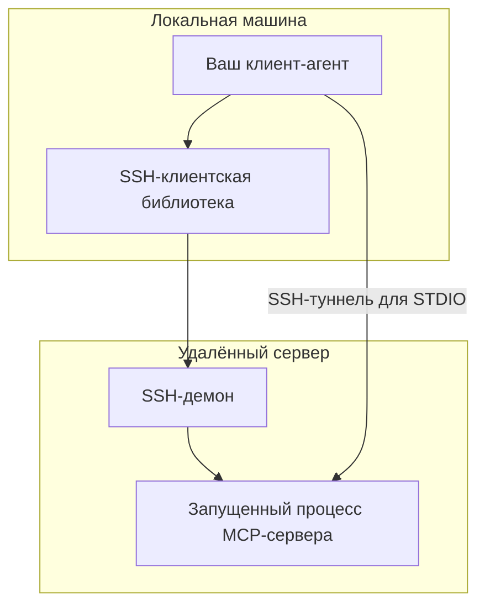

Отлично! Теперь мы говорим о вашем собственном клиенте (агенте), который будет взаимодействовать с MCP-сервером на VPS. Это меняет подход, так как вы имеете полный контроль над клиентской реализацией.

Вот детальное описание того, что нужно сделать на клиентской стороне:

---

### Архитектура связи: STDIO через SSH

Ваш клиент будет устанавливать SSH-соединение с VPS и через него запускать MCP-сервер, общаясь с ним через стандартные потоки ввода/вывода (STDIO).



---

### Клиентская реализация

#### 1. Выбор технологии и библиотек

Для реализации клиента вам понадобятся:
- **Библиотека для SSH-соединения**:
    - Python: `paramiko`, `asyncssh`
    - Node.js: `ssh2`
    - Go: `golang.org/x/crypto/ssh`
- **Реализация протокола MCP**:
    - Официальные SDK: `@modelcontextprotocol/sdk` (JavaScript/TypeScript)
    - Или реализация JSON-RPC 2.0 поверх STDIO

#### 2. Установка SSH-соединения

Пример на Python с использованием `paramiko`:

```python
import paramiko
import json

# Настройка SSH-соединения
ssh_client = paramiko.SSHClient()
ssh_client.set_missing_host_key_policy(paramiko.AutoAddPolicy())
ssh_client.connect(
    hostname='your-vps-ip',
    port=22,
    username='username',
    key_filename='/path/to/private/key'  # или password='password'
)
```

#### 3. Запуск MCP-сервера через SSH и получение STDIO

```python
# Запускаем MCP-сервер на удалённой машине
transport = ssh_client.get_transport()
channel = transport.open_session()
channel.exec_command('path/to/your/mcp/server/command')

# Получаем стандартные потоки
stdin = channel.makefile_stdin('w')
stdout = channel.makefile('r')
stderr = channel.makefile_stderr('r')
```

#### 4. Реализация MCP-протокола поверх STDIO

MCP использует JSON-RPC 2.0 сообщения, передаваемые через newline-delimited JSON:

```python
class MCPClient:
    def __init__(self, stdin, stdout, stderr):
        self.stdin = stdin
        self.stdout = stdout
        self.stderr = stderr
        self.request_id = 1
        
    def send_message(self, method, params):
        message = {
            "jsonrpc": "2.0",
            "id": self.request_id,
            "method": method,
            "params": params
        }
        self.stdin.write(json.dumps(message) + '\n')
        self.stdin.flush()
        self.request_id += 1
        
    def read_message(self):
        line = self.stdout.readline()
        if line:
            return json.loads(line)
        return None
        
    def initialize(self):
        self.send_message("initialize", {
            "protocolVersion": "2024.11.05",
            "capabilities": {
                "resources": {},
                "tools": {},
                "prompts": {}
            },
            "clientInfo": {
                "name": "Your Client Name",
                "version": "1.0.0"
            }
        })
        response = self.read_message()
        print("Server capabilities:", response)
        
    def start(self):
        self.initialize()
        # Отправляем notification о готовности
        self.send_message("notify/initialized", {})
        
        # Главный цикл обработки сообщений
        while True:
            message = self.read_message()
            if message:
                self.handle_message(message)
```

#### 5. Обработка сообщений сервера

```python
def handle_message(self, message):
    if 'method' in message:
        # Это запрос от сервера
        if message['method'] == 'resources/read':
            self.handle_resource_read(message['params'])
        elif message['method'] == 'tools/call':
            self.handle_tool_call(message['params'])
    elif 'result' in message:
        # Это ответ на наш запрос
        self.handle_response(message)
```

#### 6. Полная последовательность инициализации

1. Установить SSH-соединение
2. Запустить MCP-сервер на удалённой машине
3. Отправить сообщение `initialize` с capabilities клиента
4. Получить ответ с capabilities сервера
5. Отправить `notified/initialized`
6. Начать обмен сообщениями

---

### Альтернативный подход: SSH-портфорирование для STDIO

Если ваш MCP-клиент уже имеет встроенную поддержку STDIO, но не SSH, вы можете создать SSH-туннель:

```bash
# Создаём туннель: локальный порт -> STDIO на удалённой машине
ssh -L 127.0.0.1:1234:stdio your-vps-ip "path/to/mcp/server"
```

И подключиться к локальному порту 1234 из вашего клиента.

---

### Рекомендации по безопасности

1. **Используйте SSH-ключи** вместо паролей
2. **Ограничьте права пользователя** на VPS минимально необходимыми
3. **Валидируйте все входящие сообщения** от сервера
4. **Реализуйте таймауты** на операции чтения/записи
5. **Используйте устойчивые к разрывам соединения** с механизмом переподключения

---

### Пример минимального рабочего клиента

```python
import paramiko
import json
import threading

class SimpleMCPClient:
    def __init__(self, hostname, username, key_path, server_command):
        self.ssh = paramiko.SSHClient()
        self.ssh.set_missing_host_key_policy(paramiko.AutoAddPolicy())
        self.ssh.connect(hostname, username=username, key_filename=key_path)
        
        self.transport = self.ssh.get_transport()
        self.channel = self.transport.open_session()
        self.channel.exec_command(server_command)
        
        self.stdin = self.channel.makefile_stdin('w')
        self.stdout = self.channel.makefile('r')
        self.stderr = self.channel.makefile_stderr('r')
        
        self.request_id = 1
        
    def send(self, method, params):
        message = {
            "jsonrpc": "2.0",
            "id": self.request_id,
            "method": method,
            "params": params
        }
        self.stdin.write(json.dumps(message) + '\n')
        self.stdin.flush()
        self.request_id += 1
        
    def listen(self):
        while True:
            line = self.stdout.readline()
            if line:
                message = json.loads(line)
                print("Received:", message)
                
    def start(self):
        # Запускаем поток для прослушивания сообщений
        thread = threading.Thread(target=self.listen)
        thread.daemon = True
        thread.start()
        
        # Инициализируем соединение
        self.send("initialize", {
            "protocolVersion": "2024.11.05",
            "capabilities": {},
            "clientInfo": {"name": "Simple Client", "version": "1.0.0"}
        })
        
        # Ждем завершения
        try:
            thread.join()
        except KeyboardInterrupt:
            self.ssh.close()

# Использование
if __name__ == "__main__":
    client = SimpleMCPClient(
        "your.vps.ip",
        "username",
        "/path/to/private/key",
        "path/to/mcp/server"
    )
    client.start()
```

Это основа для создания собственного MCP-клиента. В реальной реализации вам нужно будет добавить обработку ошибок, более сложную логику работы с ресурсами и инструментами, а также механизмы повторного подключения при обрывах связи.