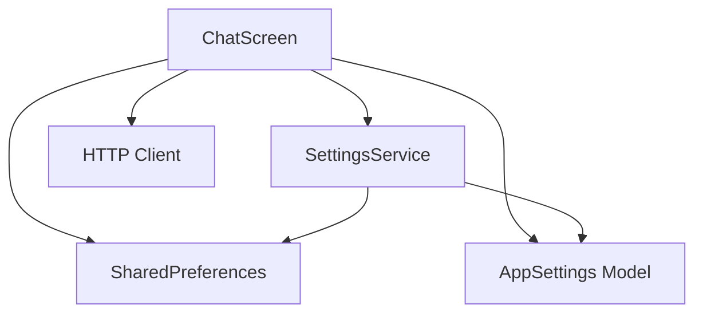
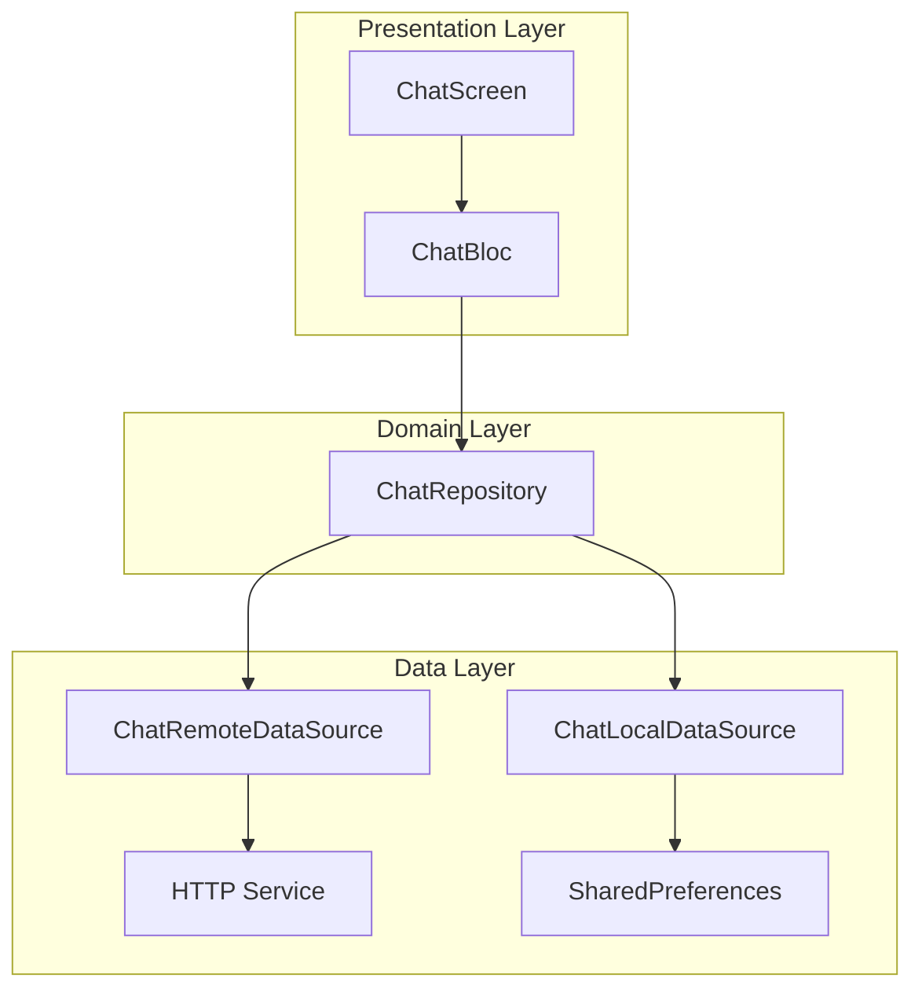

# sample_app

A new Flutter project.

## Getting Started

This project is a starting point for a Flutter application.

A few resources to get you started if this is your first Flutter project:

- [Lab: Write your first Flutter app](https://docs.flutter.dev/get-started/codelab)
- [Cookbook: Useful Flutter samples](https://docs.flutter.dev/cookbook)

For help getting started with Flutter development, view the
[online documentation](https://docs.flutter.dev/), which offers tutorials,
samples, guidance on mobile development, and a full API reference.

## MCP GitHub интеграция

Примечание: cейчас MCP сервер расположен на верхнем уровне проекта в папке `mcp_server/` (раньше был в `sample_app/mcp_server/`).

Этот проект включает поддержку работы с GitHub через внешний MCP сервер (Node.js) по WebSocket JSON-RPC. Это позволяет безопасно выносить GitHub‑токен на сервер и вызывать инструменты (`get_repo`, `search_repos`, `create_issue`) из Flutter‑приложения.

### 1) Установка и запуск MCP сервера
- Код сервера: `mcp_server/` (см. подробный `README.md` в этой папке)
- Шаги:
  1. Установите зависимости:
     ```powershell
     cd mcp_server
     npm install
     ```
  2. Создайте `.env` из шаблона и укажите токен:
     ```env
     GITHUB_TOKEN=ghp_xxx
     PORT=3001
     ```
  3. Запустите сервер:
     ```powershell
     npm start
     ```
  Ожидаемый адрес: `ws://localhost:3001`. Подробности и JSON‑RPC примеры: `mcp_server/README.md`.

### 2) Настройка в приложении (Flutter)
- Откройте экран настроек (`lib/screens/settings_screen.dart`).
- Включите переключатель: «Использовать внешний MCP сервер».
- Задайте URL: `ws://localhost:3001`.
- Нажмите «Проверить MCP» — должно показать «Подключено и инициализировано».

### 3) Быстрый тест: создание GitHub Issue
- Блок «Быстрый тест: создать GitHub Issue» отображается, если включён GitHub MCP ИЛИ включён внешний MCP сервер (условие OR).
- Заполните `owner`, `repo`, `title`, `body` и нажмите «Создать issue».
- При активном внешнем MCP сервере локальный токен в приложении не требуется. При выключенном — нужен `GITHUB_MCP_TOKEN` (режим прямых REST‑вызовов).

### 4) Основные файлы
- MCP сервер: `mcp_server/server.js`, конфиг `.env.example`, документация `mcp_server/README.md`.
- MCP клиент: `lib/services/mcp_client.dart` (подключение, initialize, tools/list, tools/call).
- Интеграция: `lib/services/mcp_integration_service.dart` (маршрутизация через MCP или прямые REST).
- Настройки: `lib/models/app_settings.dart` — поля `useMcpServer`, `mcpServerUrl`, `enabledMCPProviders`.
- UI настроек: `lib/screens/settings_screen.dart` — переключатели, ввод URL, проверка соединения, быстрый тест.

### 5) Безопасность
- Токен GitHub (`GITHUB_TOKEN`) хранится только на стороне MCP сервера (`mcp_server/.env`).
- Приложение при работе через MCP не передаёт токен по сети.

См. также: `mcp_server/README.md` для примеров JSON‑RPC (`get_repo`, `search_repos`, `create_issue`) и Dart‑примера вызова из Flutter.

## CodeOpsAgent и запуск Java в Docker

Этот проект содержит специализированного агента для операций с кодом — `CodeOpsAgent` — и новый экран `CodeOps` с чатом, интегрированным с MCP‑сервером для запуска локального Docker‑контейнера с Java JDK.

### Что умеет CodeOps
- __Чат с контекстом__: ведёт диалог, хранит историю, сжимает контекст.
- __Определение намерения__: классифицирует запрос как генерацию кода или обычный вопрос.
- __Строгий JSON-вывод__: при генерации кода запрашивает у LLM JSON по схеме (имя файла, язык, код и т. п.).
- __Подтверждение запуска__: спрашивает пользователя, запускать ли сгенерированный (или вставленный) код локально.
- __Запуск Java в Docker__: по подтверждению вызывает MCP‑инструмент `docker_start_java`, который стартует (или создаёт и стартует) контейнер.
- __Настройки__: доступ к экрану настроек из `AppBar` вкладки CodeOps (иконка шестерёнки).

### Предпосылки
- Установлен Docker Desktop / Docker Engine и запущен демон.
- Запущен MCP‑сервер из каталога `mcp_server/` (см. тамошний README), слушает `ws://localhost:3001`.

### Включение MCP в приложении
1) Откройте `Настройки` (вкладка CodeOps → иконка шестерёнки, либо общий экран настроек).
2) Включите «Использовать внешний MCP сервер».
3) Укажите `MCP WebSocket URL`: `ws://localhost:3001`.
4) Нажмите «Проверить MCP» — должно показать успешную инициализацию.

### Как пользоваться вкладкой CodeOps
1) Перейдите на вкладку `CodeOps` в нижней навигации.
2) Сформулируйте задачу, например: «Сгенерируй Java консольное Hello World».
3) Агент:
   - классифицирует запрос как `code_generate`;
   - запросит у LLM код строго в JSON по схеме:
     `{"title":"string","description":"string","language":"string","filename":"string","entrypoint":"string?","code":"string"}`;
   - покажет сводку и код; спросит: «Запустить локально?»
4) Ответьте «Да/Yes» для запуска. Агент вызовет `docker_start_java` на MCP‑сервере и покажет результат (имя контейнера, состояние).
5) Можно вставить свой код вручную — если агент распознает код, он также предложит запуск.

### Полный цикл запуска Java в Docker
По умолчанию используется образ `eclipse-temurin:17-jdk`, контейнер `java-dev`, проброс порта `8080:8080` и команда `tail -f /dev/null` (контейнер остаётся живым).

- __Автоматически (рекомендуется)__: через кнопку подтверждения в чате CodeOps. MCP‑инструмент:
  - Если контейнер `java-dev` существует и не запущен — запустит его.
  - Если контейнер отсутствует — выполнит `docker pull` и `docker run` с дефолтами.

- __Вручную (CLI, альтернативный путь)__:
  ```powershell
  # 1) Скачать образ
  docker pull eclipse-temurin:17-jdk

  # 2) Создать и запустить контейнер в фоне
  docker run -d --name java-dev --restart unless-stopped -p 8080:8080 eclipse-temurin:17-jdk tail -f /dev/null

  # 3) Проверить статус
  docker ps --filter name=^/java-dev$

  # 4) Остановить/запустить заново при необходимости
  docker stop java-dev
  docker start java-dev

  # 5) Логи (если меняли команду запуска на сервер с выводом)
  docker logs -f java-dev
  ```

> Примечание: текущая реализация только поднимает среду с JDK. Запуск и исполнение кода внутри контейнера остаются на усмотрение пользователя/агента в следующих итерациях.

### Траблшутинг
- Docker не запущен: убедитесь, что демон Docker работает (Docker Desktop/служба).
- Порт занят: измените порт в MCP‑инструменте или освободите `8080`.
- Нет доступа к образу: проверьте сеть/прокси, повторите `docker pull` вручную.
- MCP недоступен: проверьте `ws://localhost:3001`, логи `mcp_server/`.

# Архитектурный анализ Flutter-проекта sample_app

## 1. Общая оценка архитектуры

### 1.1. Структура проекта
Проект имеет базовую организацию с разделением на слои:
- **Models** ([`sample_app/lib/models/`](sample_app/lib/models/)) - слой моделей данных
- **Services** ([`sample_app/lib/services/`](sample_app/lib/services/)) - слой бизнес-логики
- **Screens** ([`sample_app/lib/screens/`](sample_app/lib/screens/)) - слой представления

### 1.2. Используемые архитектурные паттерны
Текущая архитектура следует упрощенной версии **MVC (Model-View-Controller)** с элементами **MVVM (Model-View-ViewModel)**:

**Паттерны, которые удалось выявить:**
- **Repository Pattern** - частично реализован в [`SettingsService`](sample_app/lib/services/settings_service.dart:5)
- **Service Layer** - реализован в виде сервисов для работы с настройками
- **State Management** - используется встроенный `setState()` Flutter

## 2. Детальный анализ архитектурных компонентов

### 2.1. Слой моделей (Models)
**Преимущества:**
- [`AppSettings`](sample_app/lib/models/app_settings.dart:7) - хорошо структурированная модель с immutability
- Реализованы методы `fromJson()`/`toJson()` для сериализации
- Используется `copyWith()` pattern для безопасного обновления состояния
- Наличие enum-ов для типизации ([`NeuralNetwork`](sample_app/lib/models/app_settings.dart:3), [`ResponseFormat`](sample_app/lib/models/app_settings.dart:5))

**Недостатки:**
- Отсутствует аннотация `@JsonSerializable` для автоматической генерации кода
- [`Message`](sample_app/lib/main.dart:32) модель определена внутри main.dart вместо отдельного файла

### 2.2. Слой сервисов (Services)
**Преимущества:**
- [`SettingsService`](sample_app/lib/services/settings_service.dart:5) инкапсулирует работу с `SharedPreferences`
- Обработка ошибок при загрузке/сохранении настроек
- Использование default values для отказоустойчивости

**Недостатки:**
- Отсутствие абстракций (интерфейсов) для сервисов
- Нет Dependency Injection
- Жесткая зависимость от `SharedPreferences`
- Отсутствие единого сервиса для работы с API нейросетей

### 2.3. Слой представления (Screens/Views)
**Проблемы архитектуры:**
- [`ChatScreen`](sample_app/lib/main.dart:53) содержит 488 строк кода, нарушая принцип Single Responsibility
- Смешивание бизнес-логики с UI-логикой
- Прямые HTTP-запросы из виджета (метод [`_fetchData`](sample_app/lib/main.dart:118))
- Отсутствие ViewModel/Controller для разделения логики

## 3. Выявленные слабые места и проблемы

### 3.1. Нарушение принципов SOLID
- **Single Responsibility Principle**: [`ChatScreen`](sample_app/lib/main.dart:53) выполняет множество функций
- **Dependency Inversion Principle**: Жесткие зависимости вместо абстракций
- **Open/Closed Principle**: Код сложно расширять без модификации существующего

### 3.2. Проблемы с управлением состоянием
- Использование `setState()` приводит к перерисовке всего виджета
- Отсутствие централизованного state management
- Сложности с управлением асинхронными операциями

### 3.3. Архитектурные проблемы
```
Текущая архитектура:
┌─────────────────────────────────────────┐
│            ChatScreen (488 строк)       │
│  ┌─────────────┐  ┌─────────────────┐  │
│  │   UI Logic  │  │ Business Logic  │  │
│  │             │  │                 │  │
│  │ - Rendering │  │ - HTTP requests │  │
│  │ - Events    │  │ - Data processing│  │
│  │ - State     │  │ - Settings      │  │
│  └─────────────┘  └─────────────────┘  │
└─────────────────────────────────────────┘
```

### 3.4. Проблемы с тестируемостью
- Большой класс [`ChatScreen`](sample_app/lib/main.dart:53) сложно тестировать
- Отсутствие моков для зависимостей
- Смешение логики затрудняет unit-тестирование

## 4. Рекомендации по улучшению архитектуры

### 4.1. Переход на Clean Architecture
Предлагаю следующую структуру:

```
lib/
├── core/                    # Ядро приложения
│   ├── error/              # Обработка ошибок
│   ├── network/            # Сетевой слой
│   └── constants.dart      # Константы
├── features/               # Фичи приложения
│   └── chat/              # Чат-фича
│       ├── data/          # Слой данных
│       │   ├── models/    # Модели данных
│       │   ├── repositories/ # Репозитории
│       │   └── datasources/  # Источники данных
│       ├── domain/        # Слой домена
│       │   ├── entities/  # Сущности
│       │   ├── repositories/ # Интерфейсы репозиториев
│       │   └── usecases/  # Use cases
│       └── presentation/  # Слой представления
│           ├── screens/   # Экраны
│           ├── widgets/   # Виджеты
│           ├── viewmodels/ # ViewModels
│           └── providers/ # State management
├── shared/                # Общие компоненты
│   ├── widgets/          # Переиспользуемые виджеты
│   ├── theme/            # Тема оформления
│   └── utils/            # Утилиты
└── main.dart
```

### 4.2. Внедрение State Management
Рекомендую использовать **BLoC (Business Logic Component)** или **Riverpod**:

**Преимущества BLoC:**
- Четкое разделение бизнес-логики и UI
- Тестируемость бизнес-логики
- Реактивный подход к управлению состоянием
- Хорошая интеграция с Flutter

### 4.3. Реализация Repository Pattern
```dart
// Абстрактный репозиторий
abstract class ChatRepository {
  Future<Message> sendMessage(String text);
  Stream<List<Message>> getMessages();
  Future<AppSettings> getSettings();
  Future<void> saveSettings(AppSettings settings);
}

// Реализация
class ChatRepositoryImpl implements ChatRepository {
  final ChatRemoteDataSource remoteDataSource;
  final ChatLocalDataSource localDataSource;
  
  ChatRepositoryImpl({
    required this.remoteDataSource,
    required this.localDataSource,
  });
  
  // Реализация методов...
}
```

### 4.4. Внедрение Dependency Injection
Использовать пакет **get_it** или **provider** для внедрения зависимостей:

```dart
final getIt = GetIt.instance;

void setupDependencies() {
  // Регистрация сервисов
  getIt.registerSingleton<SettingsService>(SettingsServiceImpl());
  getIt.registerSingleton<HttpService>(HttpServiceImpl());
  
  // Регистрация репозиториев
  getIt.registerSingleton<ChatRepository>(
    ChatRepositoryImpl(
      remoteDataSource: ChatRemoteDataSourceImpl(),
      localDataSource: ChatLocalDataSourceImpl(),
    ),
  );
}
```

## 5. Схема взаимодействия компонентов

### 5.1. Текущая архитектура


### 5.2. Рекомендуемая архитектура (Clean Architecture + BLoC)


## 6. Оценка масштабируемости и поддерживаемости

### 6.1. Текущая архитектура
**Масштабируемость: НИЗКАЯ**
- Добавление новых функций требует модификации больших классов
- Сложность повторного использования кода
- Проблемы с параллельной разработкой

**Поддерживаемость: НИЗКАЯ**
- Высокая связанность (coupling) между компонентами
- Сложности с调试 и тестированием
- Риск появления regression при изменениях

### 6.2. После рефакторинга
**Масштабируемость: ВЫСОКАЯ**
- Четкое разделение ответственности
- Легкое добавление новых фич
- Возможность параллельной разработки

**Поддерживаемость: ВЫСОКАЯ**
- Низкая связанность между компонентами
- Легкое тестирование каждого слоя
- Четкая структура проекта

## 7. План миграции

### Этап 1: Подготовка (1-2 дня)
1. Добавить необходимые зависимости (bloc, get_it, json_annotation)
2. Создать базовую структуру директорий
3. Настроить кодогенерацию

### Этап 2: Выделение бизнес-логики (2-3 дня)
1. Создать ChatRepository и его реализации
2. Вынести HTTP-запросы из ChatScreen в отдельные сервисы
3. Реализовать BLoC для управления состоянием чата

### Этап 3: Рефакторинг UI (2-3 дня)
1. Разбить ChatScreen на более мелкие виджеты
2. Интегрировать BLoC с UI
3. Оптимизировать перерисовки

### Этап 4: Тестирование (1-2 дня)
1. Написать тесты для всех слоев
2. Интеграционное тестирование
3. UI-тестирование

## 8. Заключение

Текущая архитектура приложения имеет серьезные проблемы с масштабируемостью и поддерживаемостью. Рекомендуется провести рефакторинг с переходом на Clean Architecture и внедрением современным паттернов управления состоянием.

**Основные преимущества предложенной архитектуры:**
- Четкое разделение ответственности
- Улучшенная тестируемость
- Легкость масштабирования
- Снижение связанности между компонентами
- Соответствие современным практикам Flutter-разработки

Для реализации предложенных изменений потребуется около 8-10 дней работы одного разработчика.