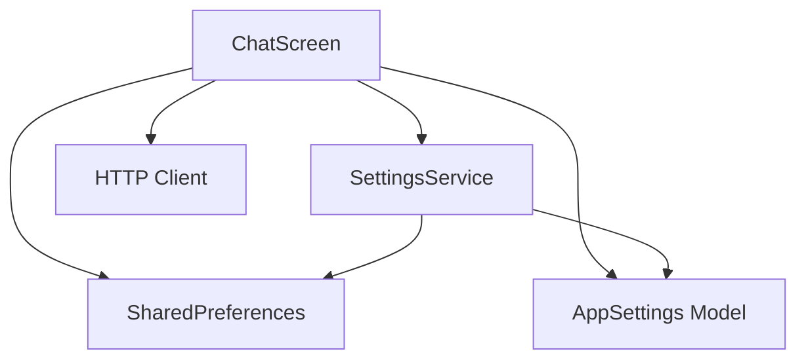
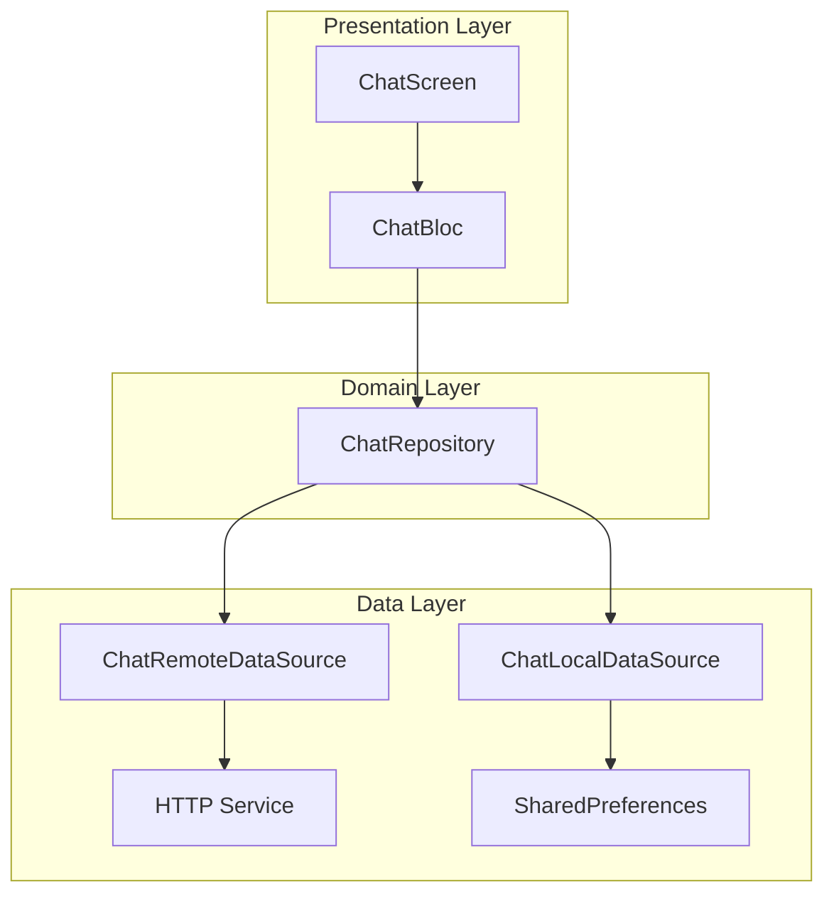

# sample_app

A new Flutter project.

## Getting Started

This project is a starting point for a Flutter application.

A few resources to get you started if this is your first Flutter project:

- [Lab: Write your first Flutter app](https://docs.flutter.dev/get-started/codelab)
- [Cookbook: Useful Flutter samples](https://docs.flutter.dev/cookbook)

For help getting started with Flutter development, view the
[online documentation](https://docs.flutter.dev/), which offers tutorials,
samples, guidance on mobile development, and a full API reference.

## YandexGPT интеграция: краткий порядок подключения

1) Получите `FOLDER_ID` в Yandex Cloud.
2) Создайте сервисный аккаунт и выдайте роль `ai.languageModels.user`.
3) Получите IAM токен на бэкенде для сервисного аккаунта.
4) Вызов API:
   - POST `https://llm.api.cloud.yandex.net/foundationModels/v1/completion`
   - Headers: `Authorization: Bearer <IAM_TOKEN>`, `x-folder-id: <FOLDER_ID>`, `Content-Type: application/json`
   - Body: `modelUri: "gpt://<FOLDER_ID>/yandexgpt(-lite)/latest"`, `completionOptions`, `messages: [{ role, text }]`
5) Безопасность: храните IAM токен на сервере и вызывайте API через ваш бэкенд‑прокси.
6) Временный fallback: `Authorization: Api-Key <YANDEX_API_KEY>` + `x-folder-id` поддержан в
   `lib/data/llm/yandexgpt_usecase.dart`.

Переменные окружения (`assets/.env`):
- `YANDEX_IAM_TOKEN=`   # предпочтительно
- `YANDEX_API_KEY=`     # временный fallback
- `YANDEX_FOLDER_ID=`
- `YANDEX_GPT_BASE_URL=`   # опционально (override эндпоинта)
- `YANDEX_MODEL_URI=`      # опционально (например: `gpt://<folder>/yandexgpt-lite/latest`)

См. реализацию: `sample_app/lib/data/llm/yandexgpt_usecase.dart`.

### Совместимость CodeOps/CodeOpsBuilderAgent с YandexGPT

- Некоторые модели YandexGPT могут игнорировать `system` и возвращать нестрогий JSON. В `yandexgpt_usecase.dart` системные инструкции встраиваются в первое `user`‑сообщение для повышения дисциплины формата.
- При отсутствии валидного JSON оркестратор `CodeOpsBuilderAgent` применяет fallback:
  - для кода: извлекает fenced‑блок (```java ... ```) и формирует минимальный JSON с `files`, определяя путь и entrypoint (Java) из кода;
  - для тестов: извлекает один/несколько тестовых классов из fenced‑блоков, корректно строит пути из `package` и имён публичных классов.
- Реализация и утилиты: `sample_app/lib/agents/code_ops_builder_agent.dart`, `sample_app/lib/utils/code_utils.dart`.
- Тесты: `sample_app/test/code_ops_builder_agent_yandex_fallback_test.dart` (проверка генерации кода/тестов и запуска JUnit с fallback).

## Голосовые функции (Yandex SpeechKit)

В приложении реализована поддержка речевых функций для провайдера YandexGPT:

- STT (распознавание речи): запись аудио в WAV 16kHz с использованием `record` v5 (`AudioRecorder` + `RecordConfig`).
- TTS (синтез речи): генерация аудио, сохранение во временный файл и воспроизведение через `audioplayers`.
- UI: кнопки записи и воспроизведения отображаются только при включённом «reasoning» режиме и выбранном провайдере `YandexGPT`.
- Права: Android — `RECORD_AUDIO` в `AndroidManifest.xml`; iOS — `NSMicrophoneUsageDescription` в `Info.plist`.
- Переменные окружения (`assets/.env`): `YANDEX_IAM_TOKEN` или `YC_IAM_TOKEN`, `YANDEX_API_KEY` (fallback), `YANDEX_FOLDER_ID`.
- Заметка: поддержка OGG формата отложена и будет добавлена позже (см. `ROADMAP.md`).

Быстрый старт по голосу:
1) Убедитесь, что заданы переменные окружения и выданы права на микрофон.
2) В настройках выберите провайдера `YandexGPT` и включите reasoning‑режим.
3) На экране чата нажмите кнопку записи, продиктуйте реплику → произойдёт STT; ответ ассистента можно озвучить через TTS.

Ключевые файлы:
- Агент: `lib/agents/reasoning_agent.dart` (методы STT/TTS и сжатие истории).
- Сервис: `lib/services/yandex_speech_service.dart` (REST вызовы SpeechKit, IAM/API‑Key аутентификация).
- UI: `lib/screens/chat_screen.dart` (кнопки записи/воспроизведения, интеграция `record`/`audioplayers`).

## User Profile / Профиль пользователя

Фича профиля пользователя добавляет персонализацию и доступ к данным пользователя для агентов.

- Модель данных: `lib/models/user_profile.dart`
  - `UserProfile { name, role, preferences[], exclusions[] }`
  - `ProfileEntry { title, description }`
  - JSON сериализация: `toJson()/fromJson()`, строки: `toJsonString()/fromJsonString()`

- Хранилище: `lib/services/user_profile_repository.dart`
  - Локальное сохранение в `SharedPreferences` (ключ `user_profile_json`)
  - Методы: `loadProfile()`, `saveProfile(profile)`

- Контроллер: `lib/services/user_profile_controller.dart`
  - `ChangeNotifier` с API: `load()`, `updateName()`, `updateRole()`, `add/edit/removePreference()`, `add/edit/removeExclusion()`

- Экран профиля: `lib/screens/profile_screen.dart`
  - Редактирование имени и роли
  - CRUD для списков «Предпочтения» и «Исключения» через модальные диалоги («Название», «Описание»)

- Интеграция в UI:
  - `lib/screens/home_screen.dart`: в AppBar отображается кнопка c именем пользователя; по нажатию — переход на `ProfileScreen`.
  - `lib/screens/chat_screen.dart`: в режиме рассуждений показывает имя и роль; профиль прокидывается в `ReasoningAgent`.
  - `lib/screens/reasoning_agent_screen.dart`: имя и роль рядом с полем ввода; профиль добавляется в `AgentRequest.context.user_profile`.

- Интеграция в агентов:
  - `lib/agents/reasoning_agent.dart`: метод `setUserProfile(UserProfile?)`; профиль добавляется в системный промпт (JSON‑секция) и в обогащённый контекст.
  - `lib/agents/multi_step_reasoning_agent.dart`: читает `req.context.user_profile` и добавляет JSON профиля в сообщения этапов (`analyze/plan`, `validate`, `synthesize`, `reflect`). Лимиты/авторизация не изменялись.

Тесты профиля:
- Юнит‑тесты: см. `test/models/user_profile_test.dart`, `test/services/user_profile_repository_test.dart`.
- Виджет‑тесты: см. `test/screens/profile_screen_test.dart`.
- Запуск: `cd sample_app && flutter test`.

## MCP GitHub интеграция

Примечание: cейчас MCP сервер расположен на верхнем уровне проекта в папке `mcp_server/` (раньше был в `sample_app/mcp_server/`).

Этот проект включает поддержку работы с GitHub через внешний MCP сервер (Node.js) по WebSocket JSON-RPC. Это позволяет безопасно выносить GitHub‑токен на сервер и вызывать инструменты (`get_repo`, `search_repos`, `create_issue`) из Flutter‑приложения.

### 1) Установка и запуск MCP сервера

- Код сервера: `mcp_server/` (см. подробный `README.md` в этой папке)
- Шаги:
  1. Установите зависимости:
     ```powershell
     cd mcp_server
     npm install
     ```
  2. Создайте `.env` из шаблона и укажите токен:
     ```env
     GITHUB_TOKEN=ghp_xxx
     PORT=3001
     ```
  3. Запустите сервер:
     ```powershell
     npm start
     ```
  Ожидаемый адрес: `ws://localhost:3001`. Подробности и JSON‑RPC примеры: `mcp_server/README.md`.

### 2) Настройка в приложении (Flutter)
- Откройте экран настроек (`lib/screens/settings_screen.dart`).
- Включите переключатель: «Использовать внешний MCP сервер».
- Задайте URL: `ws://localhost:3001`.
- Нажмите «Проверить MCP» — должно показать «Подключено и инициализировано».

### Основные файлы
- MCP сервер: `mcp_server/server.js`, конфиг `.env.example`, документация `mcp_server/README.md`.
- MCP клиент: `lib/services/mcp_client.dart` (подключение, initialize, tools/list, tools/call).
- Интеграция: `lib/services/mcp_integration_service.dart` (маршрутизация через MCP или прямые REST).
- Настройки: `lib/models/app_settings.dart` — поля `useMcpServer`, `mcpServerUrl`, `enabledMCPProviders`.
- UI настроек: `lib/screens/settings_screen.dart` — переключатели, ввод URL, проверка соединения.

### 3) Безопасность
- Токен GitHub (`GITHUB_TOKEN`) хранится только на стороне MCP сервера (`mcp_server/.env`).
- Приложение при работе через MCP не передаёт токен по сети.

См. также: `mcp_server/README.md` для примеров JSON‑RPC (`get_repo`, `search_repos`, `create_issue`) и Dart‑примера вызова из Flutter.

## Рабочее окно (Файлы‑Редактор‑Кодер)

Экран `WorkspaceScreen` — трёхпанельное окно для быстрой работы с файлами проекта на Desktop (Windows). Включает проводник слева, редактор с подсветкой по центру и чат с агентом «Кодер» (WorkspaceOrchestratorAgent) справа.

- Открытие: см. маршрутизацию экрана в `lib/screens/screens.dart` и навигацию приложения. Виджет: `lib/screens/workspace_screen.dart`.
- Платформа: Desktop (Windows) в рамках MVP. Для Web/Android/iOS — см. пост‑MVP в `roadmaps/ROADMAP_sample_app_workspace_window.md`.

Возможности:
- Проводник (левая панель):
  - Ленивая загрузка дерева директорий от заданного корня.
  - Сохранение раскрытой структуры между запусками (SharedPreferences).
  - Визуальная иерархия с отступами, подсветка активного файла.
  - Автораскрытие родительских папок для активного файла при переключении вкладок и после закрытия вкладки; прокрутка к активному файлу с центрированием.
- Редактор (центр):
  - Вкладки, заголовок — только имя файла, индикатор несохранённых изменений «●».
  - Подсветка синтаксиса (`code_text_field` + `highlight`) по расширению: `.dart`, `.js`, `.ts`, `.json`, `.yaml/.yml`, `.md`, `.kt`, `.java`.
  - Сохранение (Ctrl+S), закрытие вкладки с подтверждением при несохранённых.
  - Персист открытых вкладок и активной вкладки между запусками.
- Правая панель («Кодер»):
  - Чат с агентом `WorkspaceOrchestratorAgent` (MVP: общение через LLM, без инструментов).
  - История диалога сохраняется и восстанавливается между запусками (SharedPreferences, ключ `workspace_orchestrator`).
  - Поле «Сообщение» поддерживает перенос строки по Enter и автоматически расширяет высоту (minLines=1, maxLines=6).
  - Кнопка отправки — иконка (без надписи), отправка выполняется по нажатию кнопки.
  - Автопрокрутка в конец ленты при открытии экрана и при получении новых сообщений.
  - Кнопка очистки истории (иконка корзины в заголовке панели).

Горячие клавиши:
- Ctrl+S — сохранить активный файл.
- Ctrl+W — закрыть активную вкладку (с подтверждением, если есть несохранённые изменения).
- Ctrl+Tab — переключение на следующую вкладку с авто‑раскрытием/центрированием активного файла в проводнике.

Стартовая директория:
- По умолчанию: `D:/projects/ai_intensive/AI-intensive/`.
- Переопределение для тестов/локально: конструктор `WorkspaceScreen(rootPath: ...)`.

Зависимости редактора:
- `code_text_field`, `highlight`, `flutter_highlight` — добавлены в `pubspec.yaml`.

Ограничения MVP:
- Desktop‑только доступ к ФС (чтение/запись). Создание/удаление файлов в левой панели пока не реализовано.
- Веб/мобильные платформы требуют виртуальную ФС/другие API — см. дорожную карту.

## GitHubAgentScreen: контекст из настроек и локальный диалог

Экран GitHub‑агента использует контекст репозитория (owner/repo) из настроек приложения и не содержит полей ввода owner/repo в основном UI. Для быстрой настройки доступен локальный диалог.

- Источник настроек: `lib/models/app_settings.dart` + `lib/services/settings_service.dart`
- Экран: `lib/screens/github_agent_screen.dart`
- Поведение:
  - Заголовок экрана показывает текущий контекст `owner/repo` (Key: `github_repo_context_label`).
  - Кнопка локальных настроек (Key: `github_local_settings_btn`) открывает диалог с полями:
    - `github_local_owner_field`
    - `github_local_repo_field`
    - `github_local_repos_limit_field`
    - `github_local_issues_limit_field`
    - `github_local_other_limit_field`
    - Кнопка «Сохранить»: `github_local_save_btn`
  - Поле запроса и отправка работают всегда; при вызове MCP недостающие `owner/repo` берутся из настроек.
  - Лимиты списков применяются в `_summarizeToolResult` к репозиториям, issues, PR и файлам.
  - `ReasoningAgent` инициализируется с `extraSystemPrompt`, включающим текущие owner/repo и список доступных MCP инструментов.

Тесты и рекомендации:
- Виджет‑тесты: `test/screens/github_agent_screen_local_settings_test.dart`, `test/screens/github_agent_screen_prompt_test.dart`, `test/screens/github_agent_screen_mcp_tools_test.dart`.
- Изоляция хранилища: перед каждым тестом сбрасывайте `SharedPreferences.setMockInitialValues({})`, иначе протечёт история диалога.
- Асинхронность UI: после нажатия «Отправить» добавляйте `await tester.pump(const Duration(milliseconds: 50));` и затем `pumpAndSettle()` для стабильного ожидания MCP.
- Мок MCP‑клиента: разделяйте `tools/list` и `tools/call`; для отсутствующих handlers возвращайте JSON‑RPC `-32601` ("Tool not found").

### Стабилизация виджет‑тестов SettingsScreen

- Для устранения флаков в тестах `SettingsScreen` добавлены параметры конструктора: `settingsService`, `githubMcpService`, `mcpClient` и флаг `enableEnvChecks` (по умолчанию `true`). См. `lib/screens/settings_screen.dart`.
- В тестах передавайте `enableEnvChecks: false`, чтобы отключить фоновые проверки окружения (например, валидацию GitHub‑токена из `.env`), которые могли вызывать неожиданные асинхронные `setState`.
- Инжектируйте мок `SettingsService` через параметр `settingsService`, чтобы изолировать доступ к `SharedPreferences` и избежать протечек состояния между тестами.
- Рекомендуется после пользовательских действий вызывать `await tester.pumpAndSettle()` для стабильного ожидания всех анимаций/асинхронных задач.
- Примеры смотрите в `test/screens/settings_screen_test.dart`.

## AutoFix (MVP)

Экран и агент для базового автоматического исправления файлов.

Что делает сейчас:
- Базовый анализ одного файла или директории.
- Проверки: удаление хвостовых пробелов, добавление завершающей новой строки.
- Генерация unified‑diff и предпросмотр патчей.
- Применение патчей и откат (rollback) с бэкапом `.bak`.

Как пользоваться:
1) Откройте вкладку `AutoFix`.
2) Укажите путь к файлу/папке (можно оставить пустым — агент выдаст предупреждение и корректно завершит пайплайн).
3) Выберите режим: `File` или `Directory`.
4) Нажмите `Analyze` — в UI начнётся стрим событий и появится предпросмотр diff.
5) Нажмите `Apply` для применения патчей, либо `Rollback` для возврата из бэкапов.

События пайплайна:
- `pipeline_start` → `analysis_started` → (`analysis_result` с предупреждением, если путь пуст/нет поддерживаемых файлов) → `pipeline_complete`.

Поддерживаемые типы файлов (на этапе MVP): `.dart`, `.md`, `.java`, `.kt`.

Технические детали:
- Агент: `lib/agents/auto_fix/auto_fix_agent.dart` (стриминг событий, unified diff, базовые фиксы).
- Экран: `lib/screens/auto_fix_screen.dart`.
- Применение патчей: `lib/services/patch_apply_service.dart` (создаёт `.bak` и поддерживает `rollback`).

Тесты:
- Смоук‑тест экрана: `test/screens/auto_fix_screen_smoke_test.dart` — проверяет появление стрим‑событий и рендер UI.

Ограничения и следующие шаги (М2):
- Интеграция LLM для анализа и генерации патчей.
- Улучшение UI diff (подсветка синтаксиса, цветовые маркеры +/-, сворачивание блоков).
- Валидация применимости патча и обнаружение конфликтов.
- Расширенные unit/widget‑тесты (парсинг diff, применение/rollback, edge‑кейсы UI).
- Пакетный анализ директорий и более широкий список поддерживаемых форматов.

### AutoFix (M2): LLM‑предложения и применение LLM‑патчей

В М2 добавлен опциональный LLM‑этап, который формирует предложения (обычно в формате unified diff). Эти предложения можно просматривать отдельно и, при желании, включать в список применяемых патчей.

Как включить и использовать:
1) На экране `AutoFix` включите переключатель `LLM` (Key: `autofix_use_llm_switch`).
2) Для применения LLM‑патчей дополнительно включите флажок «Include LLM patches» (Key: `autofix_include_llm_patches_checkbox`).
3) Запустите анализ. Агент сгенерирует событие `analysis_result` с `meta.llm_raw` (сырой unified diff от модели) и финальное `pipeline_complete` с:
   - `meta.patches` — базовые фикс‑патчи (и LLM‑патчи при активном «Include LLM patches»);
   - `meta.llm_patches` — LLM‑патчи всегда отдельно, вне зависимости от включения.
4) Раздел «LLM предложения (предпросмотр)» показывает `llm_raw`. Предварительный просмотр патчей отображается в общем списке diff.

Технические детали:
- Агент: `lib/agents/auto_fix/auto_fix_agent.dart`
  - Парсит сырой unified diff (LLM) в per‑file патчи через `parseUnifiedDiffByFile` (`lib/utils/unified_diff_utils.dart`).
  - Фильтрует по поддерживаемым расширениям и выбранному пути/режиму.
  - В `pipeline_complete` публикует `llm_patches` отдельно и, при включённом флажке, добавляет их к `patches` для применения (`includeLLMInApply` в `AgentRequest.context`).
- Экран: `lib/screens/auto_fix_screen.dart`
  - Переключатель `LLM` и флажок «Include LLM patches» управляют контекстом запуска и применением патчей.
- Применение патчей: `lib/services/patch_apply_service.dart`
  - Поддерживает патчи вида `{ path, newContent }` и простые full‑file unified diff через `{ path, diff }`.
  - Для diff‑патчей извлекает `newContent` из простого unified diff и применяет с бэкапом и `rollback`.

Замечания по формату diff:
- Поддерживается разбор типичных unified diff с заголовками и стандартными hunk‑блоками; сложные контекстные изменения могут быть проигнорированы безопасно.
- Пути нормализуются для кроссплатформенной фильтрации (Windows/Unix).

## CodeOpsAgent и запуск Java в Docker

Этот проект содержит специализированного агента для операций с кодом — `CodeOpsAgent` — и экран `CodeOps` с чатом, интегрированным с MCP‑сервером для выполнения Java‑кода в Docker.

### Что умеет CodeOps
* __Чат с контекстом__: ведёт диалог, хранит историю, сжимает контекст.
* __Определение намерения__: классифицирует запрос как генерацию кода или обычный вопрос.
* __Подтверждение языка__: если язык не указан, UI задаёт уточняющий вопрос и ждёт подтверждения языка. Запуск поддержан только для Java.
* __Строгий JSON‑вывод__: при генерации кода запрашивает у LLM JSON по схеме с массивом файлов:
  `{"title":"string","description":"string","language":"string","entrypoint":"string?","files":"Array<{path:string,content:string}>"}`.
* __Многофайловая генерация__: если нужны несколько классов, каждый файл передаётся отдельно с полными импортами. UI показывает превью каждого файла.
* __Подтверждение запуска__: спрашивает пользователя, запускать ли сгенерированный (или вставленный) код локально.
* __Выполнение Java‑кода в Docker__: по подтверждению вызывает MCP‑инструмент `docker_exec_java`, передавая массив `files` и опционально `entrypoint`. Сервер компилирует и запускает код внутри контейнера и возвращает структурированный результат (stdout/stderr/exitCode).
* __Автоопределение entrypoint/filename__: клиент автоматически извлекает `public class` и `package` из Java‑кода и, при отсутствии корректного entrypoint (или если передано `"main"`), подставляет FQCN (`package.Class`) и формирует путь файла по пакету (`pkg/path/Class.java`).
* __Настройки__: доступ к экрану настроек из `AppBar` вкладки CodeOps (иконка шестерёнки).

### Предпосылки
- Установлен Docker Desktop / Docker Engine и запущен демон.
- Запущен MCP‑сервер из каталога `mcp_server/` (см. тамошний README), слушает `ws://localhost:3001`.

### Включение MCP в приложении
1) Откройте `Настройки` (вкладка CodeOps → иконка шестерёнки, либо общий экран настроек).
2) Включите «Использовать внешний MCP сервер».
3) Укажите `MCP WebSocket URL`: `ws://localhost:3001`.
4) Нажмите «Проверить MCP» — должно показать успешную инициализацию.

### Индикатор использования MCP (AppBar)
- В `CodeOpsScreen` постоянно отображается чип статуса MCP в `AppBar`.
- Состояния:
  - `MCP off` (серый) — MCP выключен или URL не задан. В тултипе: сообщение о том, что будет использован локальный fallback.
  - `MCP ready` (синий) — MCP включён и URL задан, но сейчас нет активного вызова. В тултипе: URL MCP‑сервера.
  - `MCP active` (зелёный) — идёт активный вызов MCP (например, запуск кода/тестов). Тултип: URL MCP‑сервера. Флаг активности сбрасывается автоматически через короткий таймер после завершения операции.

### Как пользоваться вкладкой CodeOps
1) Перейдите на вкладку `CodeOps` в нижней навигации.
2) Сформулируйте задачу, например: «Сгенерируй Java консольное Hello World».
3) Агент:
   - классифицирует запрос как `code_generate`;
   - если язык не указан, UI спросит «На каком языке сгенерировать код?»;
   - запросит у LLM код строго в JSON по схеме с массивом `files` (см. выше);
   - покажет сводку и превью всех файлов; спросит: «Запустить локально?»
4) Ответьте «Да/Yes» для запуска. Агент вызовет `docker_exec_java` на MCP‑сервере, передаст один или несколько файлов (и опционально entrypoint), дождётся выполнения и отобразит результат: компиляция/запуск, коды возврата, stdout/stderr.
5) Можно вставить свой код вручную — если агент распознает код (включая блоки ```java ... ```), он также предложит запуск. Для многофайлового кейса пришлите JSON в формате `files`.

### Оркестратор CodeOpsBuilderAgent: генерация → тесты → запуск

`CodeOpsBuilderAgent` надстраивается над `CodeOpsAgent` и реализует управляемый поток разработки:

- __Фаза 1: Генерация кода__
  - Классификация интента.
  - Генерация многофайлового ответа (JSON по схеме) и публикация события `code_generated` без тестовых файлов.
  - Событие `ask_create_tests` с `meta.action = 'create_tests'` — запрос на создание тестов.

- __Фаза 2: Генерация тестов__ (по подтверждению)
  - Создание JUnit4‑тестов для Java.
  - Событие `test_generated` с `meta.language` и списком `tests`.
  - Второе `ask_create_tests` с `meta.action = 'run_tests'` — запрос на запуск тестов.

- __Фаза 3: Запуск тестов__ (по подтверждению)
  - Эмитится `docker_exec_started` (пакетный старт), затем для каждого теста — `docker_exec_result` с `meta.result` (полный JSON результата) и, при повторном запуске после рефайна, `refined: true`.
  - По завершении — `pipeline_complete` с суммарным отчётом.

- __Корреляция и формат__
  - Все события содержат `runId` для связи с конкретным запуском.
  - Агент нормализует ключи результата тестов: поддерживает `exit_code`/`exitCode`, `stdout`/`stderr`.

- __Fallback поведение__
  - Если `useMcpServer` выключен или `mcpServerUrl` пуст, оркестратор делегирует запуск Java во внутренний `CodeOpsAgent` (удобно для локальных тестов/моков).
  - При включённом MCP используется локальный MCP‑клиент для вызовов `docker_exec_java`/`docker_start_java`.

Подробнее о событиях и метаданных: `docs/code_ops_builder_agent.md`.

### Режимы запуска на карточке файла (CodeOps)
На превью каждого Java-файла отображаются кнопки запуска:

* __Запуск кода__
  - Отправляет в Docker только текущий файл карточки.
  - Используется для обычных классов с `main(String[] args)`.
  - Если файл зависит от других классов, одиночная компиляция может завершиться ошибкой — это ожидаемо.

* __Запустить тест__ (показывается только на тестовых файлах: `*Test.java` или обнаружен JUnit через `org.junit`/`@Test`)
  - Собирает минимальный набор файлов: сам тест + парный исходный класс `<Name>.java` (если найден среди сгенерированных файлов), и запускает JUnit c entrypoint = FQCN теста.
  - Пример: для `CalculatorTest.java` будет автоматически добавлен `Calculator.java`, если он есть.
  - Результат выполнения (compile/run stdout/stderr, exit codes) выводится в чат.

### Полный цикл выполнения Java‑кода в Docker
По умолчанию `mcp_server` использует образ `eclipse-temurin:20-jdk` и временную рабочую директорию внутри контейнера. Инструмент `docker_exec_java`:

- принимает один файл (`filename` + `code`) или массив файлов;
- монтирует временную директорию с исходниками внутрь контейнера;
- компилирует `javac` и запускает `java` (с учётом `entrypoint`, если указан);
- возвращает структурированный JSON с результатами компиляции и запуска;
- поддерживает таймаут и лимиты ресурсов; очищает временные файлы согласно политике `cleanup`.

Примечание: если `entrypoint` не указан или равен `main`, клиент `sample_app` попытается автоматически определить главный класс и пакет из исходника и передать корректный FQCN (`com.example.App`). Также имя файла будет скорректировано под пакет: `com/example/App.java`.

### Траблшутинг
- Docker не запущен: убедитесь, что демон Docker работает (Docker Desktop/служба).
- Порт занят: измените порт в MCP‑инструменте или освободите `8080`.
- Нет доступа к образу: проверьте сеть/прокси, повторите `docker pull` вручную.
- MCP недоступен: проверьте `ws://localhost:3001`, логи `mcp_server/`.

# Архитектурный анализ Flutter-проекта sample_app

## 1. Общая оценка архитектуры

### 1.1. Структура проекта
Проект имеет базовую организацию с разделением на слои:
- **Models** ([`sample_app/lib/models/`](sample_app/lib/models/)) - слой моделей данных
- **Services** ([`sample_app/lib/services/`](sample_app/lib/services/)) - слой бизнес-логики
- **Screens** ([`sample_app/lib/screens/`](sample_app/lib/screens/)) - слой представления

### 1.2. Используемые архитектурные паттерны
Текущая архитектура следует упрощенной версии **MVC (Model-View-Controller)** с элементами **MVVM (Model-View-ViewModel)**:

**Паттерны, которые удалось выявить:**
- **Repository Pattern** - частично реализован в [`SettingsService`](sample_app/lib/services/settings_service.dart:5)
- **Service Layer** - реализован в виде сервисов для работы с настройками
- **State Management** - используется встроенный `setState()` Flutter

## 2. Детальный анализ архитектурных компонентов

### 2.1. Слой моделей (Models)
**Преимущества:**
- [`AppSettings`](sample_app/lib/models/app_settings.dart:7) - хорошо структурированная модель с immutability
- Реализованы методы `fromJson()`/`toJson()` для сериализации
- Используется `copyWith()` pattern для безопасного обновления состояния
- Наличие enum-ов для типизации ([`NeuralNetwork`](sample_app/lib/models/app_settings.dart:3), [`ResponseFormat`](sample_app/lib/models/app_settings.dart:5))

**Недостатки:**
- Отсутствует аннотация `@JsonSerializable` для автоматической генерации кода
- [`Message`](sample_app/lib/main.dart:32) модель определена внутри main.dart вместо отдельного файла

### 2.2. Слой сервисов (Services)
**Преимущества:**
- [`SettingsService`](sample_app/lib/services/settings_service.dart:5) инкапсулирует работу с `SharedPreferences`
- Обработка ошибок при загрузке/сохранении настроек
- Использование default values для отказоустойчивости

**Недостатки:**
- Отсутствие абстракций (интерфейсов) для сервисов
- Нет Dependency Injection
- Жесткая зависимость от `SharedPreferences`
- Отсутствие единого сервиса для работы с API нейросетей

### 2.3. Слой представления (Screens/Views)
**Проблемы архитектуры:**
- [`ChatScreen`](sample_app/lib/main.dart:53) содержит 488 строк кода, нарушая принцип Single Responsibility
- Смешивание бизнес-логики с UI-логикой
- Прямые HTTP-запросы из виджета (метод [`_fetchData`](sample_app/lib/main.dart:118))
- Отсутствие ViewModel/Controller для разделения логики

## 3. Выявленные слабые места и проблемы

### 3.1. Нарушение принципов SOLID
- **Single Responsibility Principle**: [`ChatScreen`](sample_app/lib/main.dart:53) выполняет множество функций
- **Dependency Inversion Principle**: Жесткие зависимости вместо абстракций
- **Open/Closed Principle**: Код сложно расширять без модификации существующего

### 3.2. Проблемы с управлением состоянием
- Использование `setState()` приводит к перерисовке всего виджета
- Отсутствие централизованного state management
- Сложности с управлением асинхронными операциями

### 3.3. Архитектурные проблемы
```
Текущая архитектура:
┌─────────────────────────────────────────┐
│            ChatScreen (488 строк)       │
│  ┌─────────────┐  ┌─────────────────┐  │
│  │   UI Logic  │  │ Business Logic  │  │
│  │             │  │                 │  │
│  │ - Rendering │  │ - HTTP requests │  │
│  │ - Events    │  │ - Data processing│  │
│  │ - State     │  │ - Settings      │  │
│  └─────────────┘  └─────────────────┘  │
└─────────────────────────────────────────┘
```

### 3.4. Проблемы с тестируемостью
- Большой класс [`ChatScreen`](sample_app/lib/main.dart:53) сложно тестировать
- Отсутствие моков для зависимостей
- Смешение логики затрудняет unit-тестирование

## 4. Рекомендации по улучшению архитектуры

### 4.1. Переход на Clean Architecture
Предлагаю следующую структуру:

```
lib/
├── core/                    # Ядро приложения
│   ├── error/              # Обработка ошибок
│   ├── network/            # Сетевой слой
│   └── constants.dart      # Константы
├── features/               # Фичи приложения
│   └── chat/              # Чат-фича
│       ├── data/          # Слой данных
│       │   ├── models/    # Модели данных
│       │   ├── repositories/ # Репозитории
│       │   └── datasources/  # Источники данных
│       ├── domain/        # Слой домена
│       │   ├── entities/  # Сущности
│       │   ├── repositories/ # Интерфейсы репозиториев
│       │   └── usecases/  # Use cases
│       └── presentation/  # Слой представления
│           ├── screens/   # Экраны
│           ├── widgets/   # Виджеты
│           ├── viewmodels/ # ViewModels
│           └── providers/ # State management
├── shared/                # Общие компоненты
│   ├── widgets/          # Переиспользуемые виджеты
│   ├── theme/            # Тема оформления
│   └── utils/            # Утилиты
└── main.dart
```

### 4.2. Внедрение State Management
Рекомендую использовать **BLoC (Business Logic Component)** или **Riverpod**:

**Преимущества BLoC:**
- Четкое разделение бизнес-логики и UI
- Тестируемость бизнес-логики
- Реактивный подход к управлению состоянием
- Хорошая интеграция с Flutter

### 4.3. Реализация Repository Pattern
```dart
// Абстрактный репозиторий
abstract class ChatRepository {
  Future<Message> sendMessage(String text);
  Stream<List<Message>> getMessages();
  Future<AppSettings> getSettings();
  Future<void> saveSettings(AppSettings settings);
}

// Реализация
class ChatRepositoryImpl implements ChatRepository {
  final ChatRemoteDataSource remoteDataSource;
  final ChatLocalDataSource localDataSource;
  
  ChatRepositoryImpl({
    required this.remoteDataSource,
    required this.localDataSource,
  });
  
  // Реализация методов...
}
```

### 4.4. Внедрение Dependency Injection
Использовать пакет **get_it** или **provider** для внедрения зависимостей:

```dart
final getIt = GetIt.instance;

void setupDependencies() {
  // Регистрация сервисов
  getIt.registerSingleton<SettingsService>(SettingsServiceImpl());
  getIt.registerSingleton<HttpService>(HttpServiceImpl());
  
  // Регистрация репозиториев
  getIt.registerSingleton<ChatRepository>(
    ChatRepositoryImpl(
      remoteDataSource: ChatRemoteDataSourceImpl(),
      localDataSource: ChatLocalDataSourceImpl(),
    ),
  );
}
```

## 5. Схема взаимодействия компонентов

### 5.1. Текущая архитектура


### 5.2. Рекомендуемая архитектура (Clean Architecture + BLoC)


## 6. Оценка масштабируемости и поддерживаемости

### 6.1. Текущая архитектура
**Масштабируемость: НИЗКАЯ**
- Добавление новых функций требует модификации больших классов
- Сложность повторного использования кода
- Проблемы с параллельной разработкой

**Поддерживаемость: НИЗКАЯ**
- Высокая связанность (coupling) между компонентами
- Сложности с调试 и тестированием
- Риск появления regression при изменениях

### 6.2. После рефакторинга
**Масштабируемость: ВЫСОКАЯ**
- Четкое разделение ответственности
- Легкое добавление новых фич
- Возможность параллельной разработки

**Поддерживаемость: ВЫСОКАЯ**
- Низкая связанность между компонентами
- Легкое тестирование каждого слоя
- Четкая структура проекта

## 7. План миграции

### Этап 1: Подготовка (1-2 дня)
1. Добавить необходимые зависимости (bloc, get_it, json_annotation)
2. Создать базовую структуру директорий
3. Настроить кодогенерацию

### Этап 2: Выделение бизнес-логики (2-3 дня)
1. Создать ChatRepository и его реализации
2. Вынести HTTP-запросы из ChatScreen в отдельные сервисы
3. Реализовать BLoC для управления состоянием чата

### Этап 3: Рефакторинг UI (2-3 дня)
1. Разбить ChatScreen на более мелкие виджеты
2. Интегрировать BLoC с UI
3. Оптимизировать перерисовки

### Этап 4: Тестирование (1-2 дня)
1. Написать тесты для всех слоев
2. Интеграционное тестирование
3. UI-тестирование

## 8. Заключение

Текущая архитектура приложения имеет серьезные проблемы с масштабируемостью и поддерживаемостью. Рекомендуется провести рефакторинг с переходом на Clean Architecture и внедрением современным паттернов управления состоянием.

**Основные преимущества предложенной архитектуры:**
- Четкое разделение ответственности
- Улучшенная тестируемость
- Легкость масштабирования
- Снижение связанности между компонентами
- Соответствие современным практикам Flutter-разработки

Для реализации предложенных изменений потребуется около 8-10 дней работы одного разработчика.