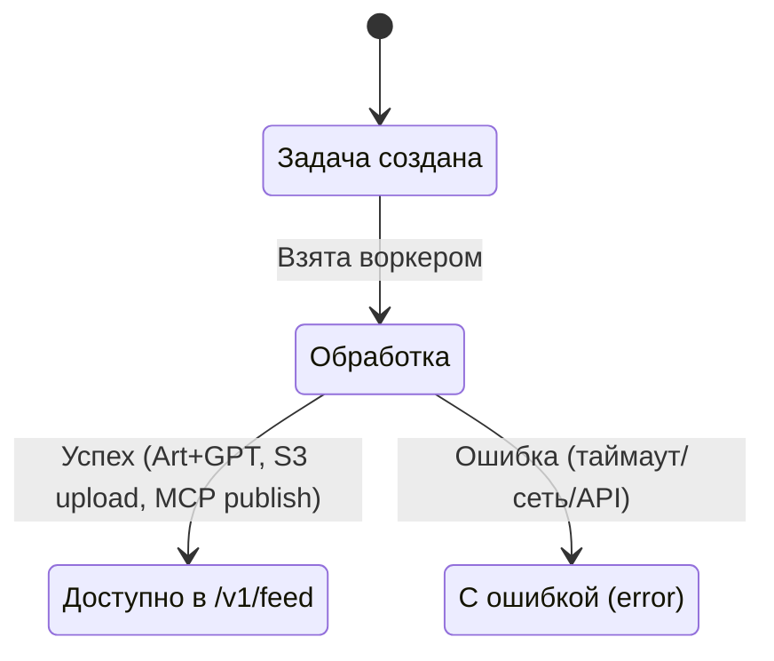
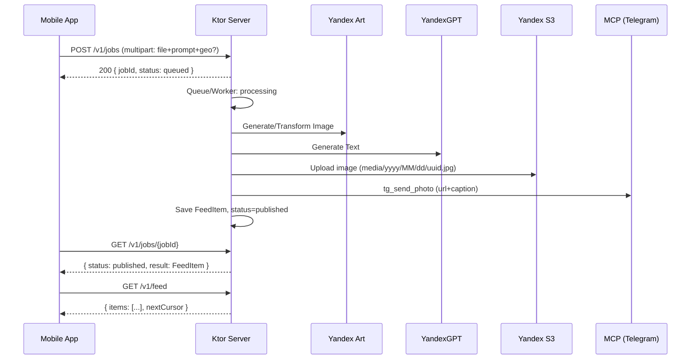

# Snap Trace AI — Kotlin Ktor Server (Оркестратор)

Ktor-сервер (Kotlin 2.1, JVM 17), который принимает фото + промпт, оркестрирует обработку (Yandex Art + YandexGPT), публикует результат через MCP (Telegram, S3) и отдает ленту результатов для мобильного приложения.

## Стек
- Kotlin 2.1.0, JVM target 17
- Ktor 3.0.1 (server-core, netty, content-negotiation, status-pages)
- kotlinx.serialization (JSON)
- Logback (логирование)

## Быстрый старт

Запуск локально (порт 8080):

```bash
# из корня репозитория
./gradlew -p snap_trace_ai/server run
# или сборка и тесты
./gradlew -p snap_trace_ai/server build test
```

Конфигурация: `src/main/resources/application.conf`

```hocon
ktor {
  deployment {
    port = 8080
  }
}
snapTrace {
  upload {
    # Максимальный размер загружаемого файла (в байтах), дефолт 15728640 (15 МБ)
    maxBytes = 15728640
  }
}
```

## Переменные окружения
- Переключение клиентов Yandex Art/GPT:
  - SNAPTRACE_USE_REAL: включить реальные клиенты (`true`/`1`/`yes`). По умолчанию — выключено (стабы).
  - YANDEX_IAM_TOKEN: IAM токен (обязателен при SNAPTRACE_USE_REAL=true)
  - YANDEX_FOLDER_ID: идентификатор каталога (обязателен при SNAPTRACE_USE_REAL=true)
  - Если любые из обязательных отсутствуют, автоматически используются стабы.
- S3 (Yandex Object Storage):
  - YC_S3_ENDPOINT, YC_S3_ACCESS_KEY, YC_S3_SECRET_KEY, YC_S3_BUCKET
- MCP:
  - MCP_SERVER_URL — WebSocket/HTTP адрес MCP
  - TELEGRAM_BOT_TOKEN, TELEGRAM_DEFAULT_CHAT_ID — для публикации в Telegram

Все секреты должны храниться безопасно (локально через .env/.properties, в проде — Secrets Manager/Lockbox).

## Эндпоинты
- GET `/health` — проверка готовности
- POST `/v1/jobs` — загрузка `multipart/form-data` (file, prompt, lat?, lon?, deviceId?) → `{ jobId, status: "queued" }`
- GET `/v1/jobs/{jobId}` — статус задачи `{ status, error?, result? }`
- GET `/v1/feed?cursor&limit` — лента `{ items[], nextCursor? }`

См. спецификацию: `../openapi.yaml`.

## Жизненный цикл задачи (Job Lifecycle)



Последовательность (высокоуровневая):



## Структура проекта
```
snap_trace_ai/server/
├─ build.gradle.kts
├─ gradle.properties
├─ settings.gradle.kts
├─ src/
│  ├─ main/
│  │  ├─ kotlin/ru/marslab/snaptrace/ai/
│  │  │  ├─ Application.kt
│  │  │  ├─ routes/
│  │  │  │  ├─ HealthRoutes.kt
│  │  │  │  ├─ JobRoutes.kt
│  │  │  │  └─ FeedRoutes.kt
│  │  │  ├─ model/Models.kt
│  │  │  ├─ store/InMemoryStore.kt
│  │  │  └─ util/Http.kt
│  │  └─ resources/
│  │     ├─ application.conf
│  │     └─ logback.xml
│  └─ test/
│     └─ kotlin/ru/marslab/snaptrace/ai/HealthRouteTest.kt
└─ README.md (этот файл)
```

## Разработка
- Кодировка: UTF-8, Kotlin style
- Логи: Logback (консоль), план — JSON-структурирование с traceId/jobId
- Ошибки: Ktor StatusPages, унифицированные ответы `ErrorResponse`

### Загрузка файлов (multipart)
- Поддерживаемые типы: `image/jpeg`, `image/png` (иначе 415 Unsupported Media Type)
- Ограничение размера: `snapTrace.upload.maxBytes` (иначе 400 file_too_large)
- Обязательные поля: `file`, `prompt` (иначе 400)

### Интеграции — Yandex Art/GPT
- Пайплайн воркера (`InMemoryStore.startWorker`):
  1) Art генерирует изображение по `prompt` (асинхронная операция с polling);
  2) GPT генерирует подпись по URL и `prompt`;
  3) Создаётся `FeedItem`, задача переходит в `published`.
- Ошибки на любом шаге приводят к статусу `failed` (покрыто тестами).
- Клиенты:
  - Реальные HTTP‑клиенты: `ru.marslab.snaptrace.ai.clients.RealArtClient`, `ru.marslab.snaptrace.ai.clients.RealGptClient` (Ktor 3, JSON, IAM Bearer + `x-folder-id`).
  - Заглушки: `ArtClientStub`, `GptClientStub`.
- Выбор клиентов осуществляется через `ClientsFactory.fromEnv()`/`fromConfig()` в `Application.serverModule()`:
  - `SNAPTRACE_USE_REAL=true|1|yes` — включает реальные клиенты при наличии `YANDEX_IAM_TOKEN` и `YANDEX_FOLDER_ID`.
  - Иначе автоматически используются стабы.
- Конфигурация (application.conf):
  - `snapTrace.yc.gpt.*`: `endpoint`, `model`, `temperature`, `maxTokens`, `systemText`;
  - `snapTrace.yc.art.*`: `endpoint`, `poll.operationsEndpoint`, `model`, `seed`, `aspect.widthRatio`, `aspect.heightRatio`, `poll.intervalMs`, `poll.timeoutMs`;
  - `snapTrace.httpClient.timeoutMs` — общий таймаут HTTP‑клиента.
- Поведение:
  - Yandex Art — старт асинхронной генерации, далее polling операций до `done` или истечения `pollTimeoutMs`; при успехе возвращается `data:image/jpeg;base64,...` URL.
  - YandexGPT — системный текст включён в первое `user`‑сообщение, ответ берётся из первой `alternative.message.text`.
- Тестируемость:
  - В `RealArtClient`/`RealGptClient` поддержана инъекция внешнего `HttpClient`.
  - Юнит‑тесты используют `Ktor MockEngine`: позитивные и негативные сценарии (пустые альтернативы/текст у GPT; timeout/`done` без изображения у Art).
  - См. тесты: `src/test/kotlin/ru/marslab/snaptrace/ai/RealGptClientTest.kt`, `src/test/kotlin/ru/marslab/snaptrace/ai/RealArtClientTest.kt`.

## Тестирование
```bash
./gradlew -p snap_trace_ai/server test
```
Покрытие расширяется по мере добавления очереди, клиентов Yandex и MCP.

## План доработок (S‑фазы)
- S1: multipart + валидация → очередь + статусы
- S3: клиенты Yandex Art/GPT
- S4: S3 upload и URL
- S5: MCP интеграции (Telegram)
- S6: лента и пагинация, затем PostgreSQL/Testcontainers

См. детальный план: `../ROADMAP.md`.
